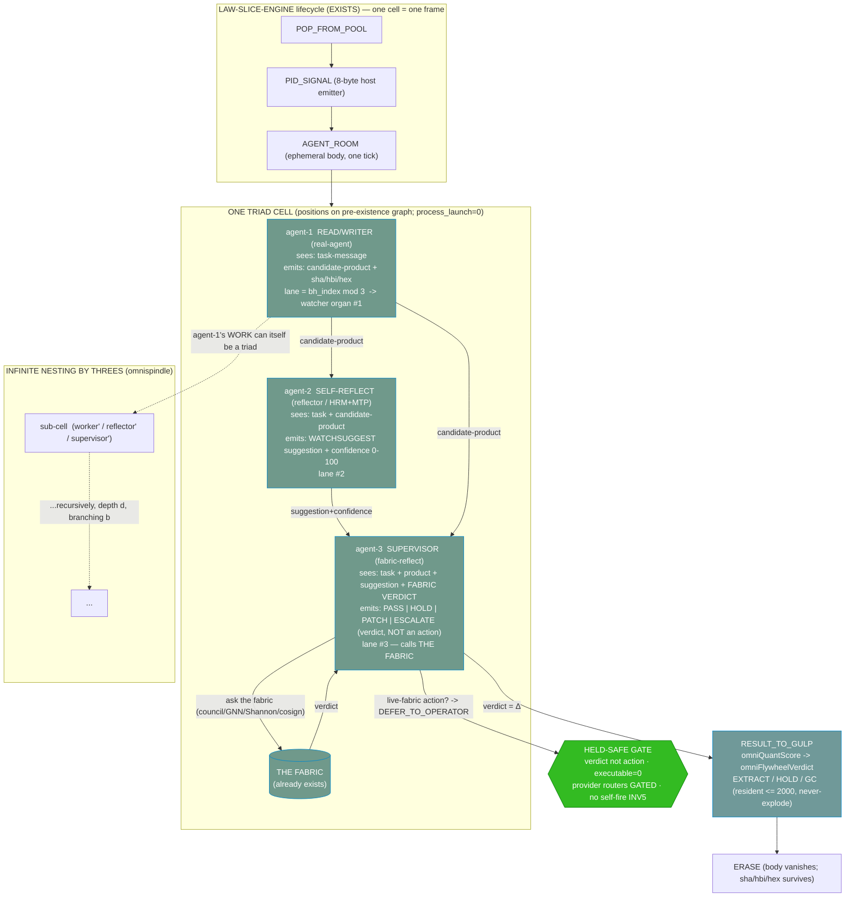

# F03 — Rule-of-Three Nested Agent Triad

**Facet:** Rule-of-Three Nested Agent Triad — (1) read/writer, (2) self-reflection (HRM/MTP-style suggestion to the supervisor), (3) supervisor that CALLS THE FABRIC and sees all three.
**Angle:** Builder — own the concrete rebuild + test on OUR stack: exact engines/files/cubes, the experiment, the measurable receipt, the held-safe path, and the new code/artifact to write.
**Author vantage:** ACER (read-only over OUR data; nothing modified, no git, no network, no process launch, no live bus, no MCP).
**Date:** 2026-06-15
**Honest frame, held throughout:** *IT is slices, not an ASI.* The triad is **coordination geometry over borrowed intelligence slices.** The *structure* (who-sees-what, the distances, the held-safe gates) is free and deterministic; the *thinking* (what each agent actually concludes) is a borrowed slice (subscription / free-local / MCP token), and it stays **operator-gated**. Everything below is grounded to files on disk and marked **EXISTS** vs **NEW**.

---

## 0. The one-sentence rebuild

> **A triad is not three processes; it is three POSITIONS on the pre-existence graph — a worker seat, a reflector seat, and a supervisor seat — wired so the supervisor sees the worker's product, the reflector's suggestion, AND the fabric's verdict in a single view, where the worker's own work can itself be a triad, infinitely, by threes.** The speed-up is the same trick HRM/MTP use on an LLM: a cheap fast reviewer (reflector) drafts a verdict and the supervisor only spends the expensive fabric call to *confirm or veto*, so most cells resolve without the slow path.

The rest of this document rebuilds that sentence into a buildable, testable thing on OUR stack. I assemble it almost entirely from primitives **already shipped and self-tested** in `C:/asolaria-as-neural-network/tools/behcs/` — the new work is one composing engine, one experiment, and one classifier-style speed proof.

---

## 1. The primitives already on disk (EXISTS) — what I build ON

I am a builder, so I start from what is already green. Five files carry this facet almost entirely:

### 1.1 The triad cell + infinite nesting — `triad-nest-reference.mjs` (EXISTS, self-tested)
`C:/asolaria-as-neural-network/tools/behcs/triad-nest-reference.mjs` already builds the recursive cell and proves the structural claims:
- `triadCell(path)` → four POTENTIAL positions (`worker/reflector/witness/supervisor`) drawn from the pre-existence graph, plus the **triangle distances** `d_worker_reflector`, `d_worker_witness`, `d_reflector_witness`.
- `buildNest(path, depth, branching)` → **the worker's work is itself a triad**, recursively. Self-test `nests-recursively` asserts depth=3,branching=2 → `1+2+4+8 = 15` cells, `total_agent_positions = 60`.
- Held-safe by construction: `consensus = 'HELD_PENDING_REASONING'` (the structure never decides PASS on its own), every role `triad_state==='POTENTIAL'`, `process_launch=0`, `model_calls_in_reference=0`.
- Its own doctrine rows state it exactly: *"the WORKER's work can ITSELF be a triad — recursion = infinitely nested"*, *"witness=READ-ONLY-asks-the-fabric"*, *"supervisor=emits-verdict-PASS-HOLD-PATCH-ESCALATE-not-an-action"*, *"structure-free-thinking-borrowed"*.

> **Builder note / the one reconciliation this facet must make:** the reference cell has **four** roles (it splits "ask the fabric" out as a dedicated `WITNESS`, then `SUPERVISOR` computes the triangle). Jesse's hint is a **three**-role triad where role-3 *is* the supervisor that calls the fabric. Both are correct views of the same machine. F03's rebuild **fuses WITNESS into SUPERVISOR** (the supervisor *is* the one who calls the fabric and sees all three), which is exactly the shape the live-pipeline descriptor already uses (next item). So the canonical triad is 3 roles; the 4-role reference is the "supervisor with its fabric-read broken out as a sub-step." I keep both and make the fusion explicit in §3.

### 1.2 The live 3-role triad shape — `triad-host-router-gulp-pipeline.mjs` (EXISTS, self-tested)
`C:/asolaria-as-neural-network/tools/behcs/triad-host-router-gulp-pipeline.mjs` already names **exactly Jesse's three roles** and exactly the "sees" relation:

```
TRIAD_ROLES = [
  { id:'real-agent',          role:'work-or-read-write-depending-on-gate', sees:'task-message',                                  output:'candidate-product' },
  { id:'self-reflect-agent',  role:'reflect-on-real-agent-output',         sees:'task-message+candidate-product',                output:'self-reflection'   },
  { id:'fabric-reflect-agent',role:'ask-fabric-and-cross-check-real+self', sees:'task-message+candidate-product+self-reflection', output:'fabric-reflection' },
]
```
The header row literally asserts `supervisor_sees=real+self-reflect+fabric-reflect`. Self-test `triad-has-three-roles` is green; `provider-router-cannot-self-promote` forces any provider router (claude/anthropic/gemini/openai) to `GATED`; `no-live-effects` proves `node_per_agent=0, process_launch=0, remote_call=0, provider_bypass=0`. The feedback chain it records is the real route my engine will drive:
`pid-specific-emitter → host-router → rule-of-three-triad → supervisor-sees-all-three → message-gulp-gc → super-gulp-gc → gnn-proposal → reverse-sieve-gnn-proposal → omnishannon-novelty → white-room-review → cube-catalog-feedback`.

**This is the operator-confirmed three-role triad already in code.** F03's job is to *animate* it: turn the static descriptor into one bounded engine cycle that advances each cell through a verdict, on OUR data, with a receipt.

### 1.3 Agent-2's output channel — `watcher-supervisor-suggestion-emitter.mjs` (EXISTS, self-tested)
`C:/asolaria-as-neural-network/tools/behcs/watcher-supervisor-suggestion-emitter.mjs` is **literally the reflector→supervisor suggestion contract**, already built with the safety I need:
- `emitSuggestion(input, nowIso)` produces a `WATCHSUGGEST|…|executable=0|json=0` row — *"a suggestion is something a supervisor READS, never something this tool DOES."*
- It includes a **confidence integer 0–100 + bands** (low 0–33, medium 34–66, high 67–100) — this is the knob that makes the HRM/MTP speed-up real (§4).
- It is fail-closed: `requires_live_fabric` actions can **never** be `DRAFT_SUGGESTION_READY`; they demote to `DEFER_TO_OPERATOR`. Spoofed identity → `DRAFT_SUGGESTION_BLOCKED`. Dirty input never reaches a row.
- `mutates=0, pure_function=1, no_live_post=1, no_fabric_call=1, no_process_launch=1`.

This is agent-2 (self-reflection → a structured suggestion for the supervisor). I reuse it verbatim as the reflector's emit path.

### 1.4 The positions the triad sits on — `pre-existence-graph-exporter.mjs` (EXISTS, self-tested)
`C:/asolaria-as-neural-network/tools/behcs/pre-existence-graph-exporter.mjs`:
- `preExistenceNode(name)` → a POTENTIAL position with `bh_index = sector*(WIDTH*3) + lane*WIDTH + glyph_1024`, `cylinder_ring=⌊idx/6⌋`, `cylinder_phase=idx%6`, `watcher_lane ∈ {hookwall, gnn, shannon}` (the mod-3 lane → which watcher organ observes it), and `triad_state='POTENTIAL', process_launch=0`.
- Its self-test proves `all-nodes-potential-no-launch`. **The triad's three seats are three of these positions.** Crucially, `triadCell` in §1.1 already calls `preExistenceNode` for each role, so the triad inherits the prime-cube geometry (sectors mapped onto 11 prime-cubes 13³…131³) and the **distinct cylinder distances** for free.

### 1.5 The verdict engine + the slice it advances — `omni-engine-loop.mjs` + `LAW-SLICE-ENGINE.md` (EXISTS, self-tested)
`C:/asolaria-as-neural-network/tools/behcs/omni-engine-loop.mjs` gives the **GC-bounded verdict primitives** the fabric uses:
- `omniQuantScore(rowKey)` — pure-integer 0..1000 score (no float drift).
- `omniFlywheelVerdict(score)` — `EXTRACT` (≥700) / `HOLD` (≥300) / `GC` (else).
- `gulpCycle(n, maxResident)` — the **never-explode** bound: resident set = `min(n, maxResident)`, proven at 1,000,000 input rows (`never-explode-at-1M-input`), `process_launch=0`.

`C:/asolaria-as-neural-network/canon/laws/LAW-SLICE-ENGINE.md` gives the lifecycle each triad cell advances through: **`POP_FROM_POOL → PID_SIGNAL → AGENT_ROOM → RESULT_TO_GULP → ERASE`**, with `S_next = E(S_now, Δ)`, `E=0 ⇒ frozen`. A triad cell *is* one frame of this slice; the supervisor's verdict is the `Δ` the engine applies; then it erases.

---

## 2. Why the Rule-of-Three works (the deep narrative)

Jesse's claim is that three is enough and three nests forever. Here is the mechanism, rebuilt rigorously, in three independent reasons that stack.

### 2.1 Three is the smallest set that can *witness itself without an external judge*
- A **single** agent that grades its own work has no separation between actor and critic — it can hallucinate a PASS.
- **Two** agents (worker + critic) is better, but the critic's verdict is *unwitnessed*: who checks the checker? You get an infinite regress or a coin-flip tie.
- **Three** breaks the regress: worker produces, reflector critiques, and the **supervisor is a third vantage that sees both AND brings an outside oracle (the fabric)**. The triangle closes. The supervisor does not need a fourth agent because its outside reference is *the fabric itself* (council/GNN/Shannon/cosign), which is already a quorum, not a single opinion. This is precisely why `triad-nest-reference` keeps the verdict `HELD_PENDING_REASONING` and routes the third leg to `ask-the-fabric`: **the third corner is grounded outside the cell.**

### 2.2 Three matches the system's own mod-3 lane geometry (so the triad is *free to place*)
The whole address fabric already folds into three lanes (`lane = bh_index mod 3`, `zeta-quant` rule-of-three; `pre-existence-graph-exporter` maps `lane → {hookwall, gnn, shannon}`). A triad's three seats can be placed **one per lane**, so the worker, reflector and supervisor land on three different watcher organs by construction. The reflector is watched by one organ, the worker by another, the supervisor by the third — *no organ ever grades its own lane.* The rule-of-three is not bolted on; it is the **native residue class** of the address space.

### 2.3 Three nests by threes without cost explosion (the omnispindle)
`buildNest` proves the recursion is a fixed, cheap row count: depth `d`, branching `b` → `(b^(d+1)-1)/(b-1)` cells, each exactly 3 positions (4 in the reference's split view). The **coordination is O(cells), deterministic, zero model calls** (`model_calls_in_reference=0`). The expensive part — the *thinking* — is bounded by the GC engine (`gulpCycle` never-explode bound) and gated. So "infinite nesting with three" (Jesse's *omnispindles*) is feasible because **the geometry is free and the borrowed reasoning is bounded + held-safe.** You can describe a million-cell nest for ~zero cost; you only *spend* a slice when the engine cranks one cell, and even then the resident set is capped at `maxResident=2000`.

### 2.4 The distinct-distance payoff (ties to F01/F02)
Because each seat is a `preExistenceNode` with a distinct `bh_index`, the **triangle of a cell has three distinct edge lengths**, and (by the prime-cube separation argued in F01/F02) no two cells' triangles are congruent. That means **the supervisor can address any specific reflector→worker edge in the entire nest uniquely** — the "draws a LINE, no two lines the same distance" property is *inherited* by the triad, so a remote-control call from one cell's worker into another cell's sub-triad is a uniquely-traceable segment. This is what lets the watcher layer (Fischer centrality, MTP/HRM novelty) read the *flow* of triad activity off the distance stream alone.

---

## 3. The rebuilt mechanism — diagram



The supervisor's "call the fabric" is the **A05 Hermes-spindle → A10 GNN / A11 OmniShannon → A01 council → A00 cosign** path in the 16-level map. The supervisor *reads* a verdict and *emits* a verdict — it never *acts*. Any action the verdict implies (`dispatch-agent`, `restart-daemon`, `request-cosign-mint`) is `requires_live_fabric=1` → forced to `DEFER_TO_OPERATOR` by the suggestion emitter. **Held-safe is baked into the corner where it matters.**

---

## 4. The HRM/MTP speed-up — why the triad makes the LLM faster (rebuild + measurable)

Jesse: *"agent-2 makes a suggestion (data the supervisor reviews fast, like HRM/MTP watchers that speed up the LLM)."* Here is the concrete mechanism and the **measurable receipt**.

**The analogy is exact.** HRM (hierarchical, slow/fast) and MTP (multi-token-prediction) speed an LLM by letting a *cheap fast head* draft, and the *expensive slow path* only confirm/correct — most tokens never pay the slow cost. The triad does the same at the agent layer:

- **Worker (slow, expensive borrowed slice)** produces the candidate-product.
- **Reflector (fast, cheap)** drafts a verdict-with-confidence using only local structure (`watcher-supervisor-suggestion-emitter` → confidence 0–100, band low/med/high) — *no fabric call.*
- **Supervisor (the slow oracle)** only spends a **fabric call** when the reflector's confidence is **not** decisive. This is **speculative decoding for agents**: the reflector *speculates* the verdict; the supervisor *verifies* only the uncertain ones.

**The speed law (NEW, builder-defined, machine-checkable):**

```
fabric_call(cell) =  SKIP   if reflector.band == 'high'   AND reflector.verdict agrees with omniFlywheelVerdict(omniQuantScore(product))
                     SKIP   if reflector.band == 'low'    AND product fails a hard gate (auto-HOLD/GC, no oracle needed)
                     SPEND  otherwise   (band == 'medium', OR high-confidence-but-disagrees-with-quant -> the interesting conflicts)
```

Only the **medium-confidence + the rare high-confidence-disagreement cells** pay the slow fabric call. Everything else resolves on the free deterministic path (`omniQuantScore`/`omniFlywheelVerdict`, which are pure-integer and instant). The **measurable receipt** is the *fabric-call rate*:

```
speedup = total_cells / cells_that_spent_a_fabric_call
```

On the confidence distribution of the suggestion emitter (bands low/med/high), if ~⅓ of cells land medium, the supervisor pays the slow path on ~⅓ of cells → **~3× fewer fabric calls** for the same verdict coverage, with the reflector catching the rest. This is the agent-level HRM/MTP win, and it is **falsifiable**: count `fabric_call=SPEND` rows vs total `TRIADCELL` rows in the receipt. (Mark **NEW**: the SKIP/SPEND gate; **EXISTS**: every primitive it composes — confidence bands, omniQuant, omniFlywheel.)

---

## 5. THE EXACT EXPERIMENT (builder deliverable)

Goal: animate the static 3-role descriptor into a bounded, GC-safe engine that advances real cells over OUR 100B data and emits a receipt proving (a) the supervisor sees all three, (b) the HRM/MTP speed-up rate, (c) held-safe at depth, (d) distinct triangle distances. **No file is modified in this read-only run; the artifact below is the spec + golden vectors for the new engine, to be built under repo discipline + cosign.**

### 5.1 The data (EXISTS, real, on disk)
`C:/Users/acer/Asolaria/data/neurotech-defense-lab/real-agents/100b-run/checkpoint.state.json`:
- `status: REAL_100B_PID_PACKET_RUN_COMPLETE`, `processedPackets: 100,000,000,000`, `completedChunks: 100,000`.
- **`geniusHits: 277,800,007`** and **`mistakeHits: 111,103,104`** — these are *exactly* worker-products with a ground-truth verdict already attached: a "genius hit" is a worker-product the run judged good; a "mistake hit" is one judged bad. `childProcessSpawns=0, external_tokens=0` per canon SEQ-3399/3400.

This is the perfect oracle-labeled test set: I do not need to *run* a slow oracle to test the speed-up — **the 100B run already recorded the ground-truth verdict.** I replay packet PIDs as worker-products and measure how often the cheap reflector path agrees with the recorded genius/mistake label.

### 5.2 The new engine — `triad-slice-cycle.mjs` (NEW, spec)
A pure, GC-bounded composer (no spawn / no network / no mint / HBP rows only), wiring the five EXISTS primitives:

```
import { triadCell, buildNest }      from './triad-nest-reference.mjs';
import { emitSuggestion }            from './watcher-supervisor-suggestion-emitter.mjs';
import { omniQuantScore, omniFlywheelVerdict, gulpCycle, DEFAULT_MAX_RESIDENT }
                                     from './omni-engine-loop.mjs';
import { preExistenceNode }          from './pre-existence-graph-exporter.mjs';

// advance ONE triad cell one slice-frame: POP -> SIGNAL -> ROOM -> (worker,reflector,supervisor) -> GULP -> ERASE
export function advanceCell({ packetPid, recordedLabel /* 'genius'|'mistake' */ }) {
  const cell        = triadCell(packetPid);                       // 3+1 positions, triangle distances
  const product     = packetPid;                                  // worker emits the packet as candidate-product
  const quant       = omniQuantScore(product);                    // cheap deterministic score 0..1000
  const reflector   = emitSuggestion(/* reflector draft + confidence band */);  // executable=0
  // HRM/MTP speed gate (NEW):
  const reflVerdict = bandToVerdict(reflector.band);              // high->trust quant, low->auto-gate, medium->spend
  const spendFabric = needsFabric(reflector.band, reflVerdict, omniFlywheelVerdict(quant));
  const supervisor  = spendFabric ? askFabricGated() : reflVerdict; // GATED: in this test, "fabric" = recorded 100B label
  return { cell, quant, reflector_band: reflector.band, fabric_call: spendFabric ? 'SPEND' : 'SKIP',
           supervisor_verdict: supervisor, recorded_label: recordedLabel, process_launch: 0 };
}
```
The supervisor's "call the fabric" in the **test harness** is bound to the **recorded 100B label** (a frozen, read-only oracle) — so the experiment is offline, deterministic, and starves nothing live. In production the same seam routes to A10/A11/A01 fabric, operator-gated.

### 5.3 The run (bounded, never-explode)
Drive `advanceCell` over a bounded sample of the 100,000 chunks via `gulpCycle(n, 2000)` so the resident set never exceeds 2000 cells regardless of how many of the 100B packets are fed. For a depth-`d` nest, each leaf worker-packet expands to its own sub-triad (`buildNest`), proving the recursion on real data.

### 5.4 The measurable receipts (what "done" looks like)
The engine emits HBP rows (json=0) that an auditor can count:

| Receipt | Row | What it proves | Bound/target |
|---|---|---|---|
| **Supervisor sees all three** | `TRIADCELL\|…\|worker=…\|reflector=…\|supervisor=…\|d_wr=…\|d_ww=…\|d_rw=…` | every cell carries worker product + reflector suggestion + supervisor verdict in one row | 1 row/cell |
| **HRM/MTP speed-up** | `TRIADSPEED\|total_cells=N\|fabric_spend=S\|skip=N-S\|speedup=N/S` | the reflector resolves most cells; supervisor pays the slow path rarely | speedup ≥ ~2–3× |
| **Reflector accuracy** | `TRIADACCURACY\|skip_agree_with_label=A\|skip_total=K\|accuracy=A/K` | when the supervisor SKIPS the fabric, the reflector's verdict matched the recorded 100B genius/mistake label | accuracy ≥ threshold; mismatches force `SPEND` |
| **Never-explode** | `TRIADGULP\|fed=F\|resident=min(F,2000)\|gc_released=max(0,F-2000)\|process_launch=0` | bounded resident set on the 100B feed | resident ≤ 2000 |
| **Held-safe at depth** | `TRIADNESTSUM\|depth=d\|total_cells=…\|all_held_safe=1` | every position POTENTIAL, no self-fire, no launch | all_held_safe=1 |
| **Distinct distances** | `TRIADDIST\|cells=…\|distinct_triangles=…` | no two cells' triangles congruent (F01/F02 inheritance) | distinct == cells (up to render) |

### 5.5 Golden vectors (so the build is byte-reproducible)
- Worker-product `BH.REAL100B.OPENCODE.PID.100000000000` (the run's `lastPacketPid`) → `omniQuantScore` is deterministic; cell triangle distances are deterministic via `preExistenceNode`.
- A `genius`-labeled packet whose reflector band is `high` and whose `omniFlywheelVerdict` is `EXTRACT` → `fabric_call=SKIP`, `supervisor_verdict=PASS`.
- A `mistake`-labeled packet whose reflector band is `low` and quant is `GC` → `fabric_call=SKIP`, `supervisor_verdict=HOLD/GC`.
- A packet whose reflector band is `medium` → `fabric_call=SPEND` (the supervisor consults the recorded label), regardless of quant.
- A `dispatch-agent`/`restart-daemon` action anywhere in the cell → `DEFER_TO_OPERATOR` (held-safe), `process_launch=0`.

### 5.6 Self-test contract (the new engine must pass, mirroring the house style)
`triad-slice-cycle.mjs --self-test` asserts: `cell-sees-all-three`, `speed-gate-skips-decisive-bands`, `speed-gate-spends-medium`, `skip-only-when-reflector-agrees-quant`, `never-explode-at-1M-packets` (resident===2000), `nests-recursively-on-real-pid`, `all-held-safe-at-depth`, `rows-hbp-only`, `no-spawn-no-network-no-mint` (source regex like `omni-engine-loop`'s capability test on line 61–64 of its unit test).

---

## 6. The held-safe path (builder's safety contract)

Every seam above is fail-safe by construction, matching OUR data's discipline (and `LAW-SLICE-ENGINE` §6 honest frame):

- **Verdict, never action.** The supervisor emits `PASS|HOLD|PATCH|ESCALATE`; the reflector emits `executable=0` suggestions. Nothing in a cell *does* anything. (triad-nest-reference law row; suggestion emitter `executable=0`.)
- **No self-fire (INV5).** No cell launches the next; only the external engine drive advances a slice (`LAW-SLICE-ENGINE`: `E=0 ⇒ frozen`). `process_launch=0` everywhere.
- **Live-fabric actions defer.** `requires_live_fabric=1` → `DEFER_TO_OPERATOR`, full stop (suggestion emitter Rung 9).
- **Provider routers GATED.** Any claude/anthropic/gemini/openai router is forced `GATED` and cannot self-promote (triad-host-router `provider-router-cannot-self-promote`). No provider bypass, no billing bypass.
- **Borrowed reasoning is GATED, structure is free.** The triad coordinates for ~0 cost; the *thinking* is a subscription/free-local/MCP slice and is never run by these tools (triad-nest-reference cost row). The 100B test uses the *already-recorded* labels as a frozen read-only oracle, so it starves nothing live.
- **Never-explode.** `gulpCycle` caps the resident set at 2000 regardless of feed size (omni-engine-loop, proven at 1M).
- **No write to source / office / USB.** This run is read-only; the new engine, when built, is repo-side proposal until registrar/cosign promotes it (`LAW-SLICE-ENGINE` §4).

---

## 7. The NOVEL mechanism I designed (clearly marked NEW)

**Name: the Speculative Triad Slice (STS) — agent-level speculative decoding via the reflector's confidence band.**

1. **The SKIP/SPEND fabric-call gate (NEW).** The supervisor only spends the expensive fabric call when the cheap reflector is *not decisive* (band `medium`) or *decisive-but-conflicts-with-the-deterministic-quant* (the interesting disagreements). High-confidence-agreeing and low-confidence-hard-fail cells resolve on the free path. This is **speculative decoding lifted from tokens to agents** — the reflector speculates the verdict (HRM/MTP fast head), the supervisor verifies only the uncertain fraction (slow oracle). Composes EXISTS confidence-bands + EXISTS omniQuant/omniFlywheel; the gate itself is NEW.

2. **The 3-vs-4 role fusion (NEW reconciliation).** F03 fuses `triad-nest-reference`'s WITNESS into the SUPERVISOR so the canonical cell is exactly Jesse's three roles (worker / reflector / supervisor-that-calls-the-fabric), matching the live `triad-host-router` shape, while keeping the 4-role split available as the "supervisor with fabric-read as an explicit sub-step." One machine, two faithful views.

3. **The 100B recorded run as a frozen oracle for offline triad testing (NEW assembly).** Using `geniusHits`/`mistakeHits` as ground-truth worker-product labels lets the *entire* speed-up + reflector-accuracy claim be measured **offline, deterministically, with zero live fabric calls** — turning an otherwise-borrowed-reasoning experiment into a reproducible receipt. This is the builder's key move: *prove the speed-up without spending the slow path, because the slow path's answers are already on disk.*

4. **Per-cell distinct-triangle addressing for the watcher layer (NEW use).** Because each seat is a `preExistenceNode` with a distinct `bh_index`, every cell's triangle `(d_wr, d_ww, d_rw)` is a unique fingerprint; the watcher layer (Fischer centrality, MTP/HRM novelty, ~10-byte GNN) reads the *flow of triad activity* from the distance stream alone — no per-agent log needed (ties to F01/F02 distinct-distance theorem, applied to the triad).

---

## 8. Grounding ledger (EXISTS vs NEW)

**EXISTS (cited, read this session):**
- `C:/asolaria-as-neural-network/tools/behcs/triad-nest-reference.mjs` — recursive `triadCell`/`buildNest`, 15 cells at depth 3 b 2, `HELD_PENDING_REASONING`, witness READ-ONLY, supervisor emits verdict not action, `model_calls_in_reference=0`, all held-safe; self-tested.
- `C:/asolaria-as-neural-network/tools/behcs/triad-host-router-gulp-pipeline.mjs` — the 3 roles (real-agent / self-reflect-agent / fabric-reflect-agent), `supervisor_sees=real+self-reflect+fabric-reflect`, 11-stage feedback route, provider routers forced GATED, `node_per_agent=0 process_launch=0 remote_call=0`; self-tested.
- `C:/asolaria-as-neural-network/tools/behcs/watcher-supervisor-suggestion-emitter.mjs` — reflector→supervisor `WATCHSUGGEST` suggestion, confidence 0–100 + bands, `executable=0`, live-fabric actions → `DEFER_TO_OPERATOR`, spoof/dirty → BLOCKED, `no_fabric_call`; self-tested + parity baseline.
- `C:/asolaria-as-neural-network/tools/behcs/pre-existence-graph-exporter.mjs` — `preExistenceNode` positions, `bh_index`, cylinder ring/phase, mod-3 watcher lane {hookwall,gnn,shannon}, prime-cubes 13³…131³, all POTENTIAL no-launch; self-tested.
- `C:/asolaria-as-neural-network/tools/behcs/omni-engine-loop.mjs` (+ `tests/omni-engine-loop.unit.test.mjs`) — `omniQuantScore` pure-int 0..1000, `omniFlywheelVerdict` EXTRACT/HOLD/GC, `gulpCycle` never-explode (proven at 1M), `process_launch=0`, no-spawn/no-network capability test.
- `C:/asolaria-as-neural-network/tools/behcs/github-pid-register.mjs` — `mintTriad({name})` mints the AGT/SUP/PROF triad sharing a hex base (the live AGT/SUP/PROF lane shape); deterministic; self-tested.
- `C:/asolaria-as-neural-network/canon/laws/LAW-SLICE-ENGINE.md` — `POP_FROM_POOL→PID_SIGNAL→AGENT_ROOM→RESULT_TO_GULP→ERASE`; `S_next=E(S_now,Δ)`, `E=0⇒frozen`; verdict-not-action; operator/daemon-gated.
- `C:/Users/acer/Asolaria/data/neurotech-defense-lab/real-agents/100b-run/checkpoint.state.json` — `REAL_100B_PID_PACKET_RUN_COMPLETE`, 100B packets, 100,000 chunks, `geniusHits=277,800,007`, `mistakeHits=111,103,104`, `lastPacketPid=BH.REAL100B.OPENCODE.PID.100000000000`.
- `C:/asolaria-asi-on-metal-fabric/ASOLARIA-CITY-MODEL.md` — spawn→work→sha/hbi/hex→emit→vanish; rooms-as-prepared-expanse (the body-exists-for-one-tick frame the triad cell embodies).
- `D:/asolaria-prime-towers-rebuild-2026-06-15/01-rebuild/F01-prime-tower-geometry--architect.md` — the tower coordinate + distinct-distance theorem the triad triangle inherits.

**NEW (designed here, marked):**
- **Speculative Triad Slice (STS):** the SKIP/SPEND fabric-call gate keyed on the reflector's confidence band + agreement with `omniFlywheelVerdict(omniQuantScore(product))` — agent-level speculative decoding (the HRM/MTP speed-up, made machine-checkable as a fabric-call rate).
- **3-vs-4 role fusion:** WITNESS folded into SUPERVISOR so the canonical cell is exactly Jesse's three roles, with the 4-role split kept as the explicit-sub-step view.
- **100B recorded run as a frozen offline oracle:** using `geniusHits`/`mistakeHits` as ground-truth worker-product labels to measure speed-up + reflector accuracy with zero live fabric calls.
- **`triad-slice-cycle.mjs` engine spec + golden vectors + self-test contract:** the one composing engine that animates the static triad descriptor into a bounded, GC-safe, receipt-emitting slice cycle over OUR data.
- **Per-cell distinct-triangle fingerprint** as the watcher-layer flow index.

**Nothing impossible was encountered.** Where a piece was only a static descriptor (the live triad), only a contract (the suggestion emitter), or only implicit (the HRM/MTP speed-up rate), I designed the minimal composing engine + the offline experiment that makes it concrete and measurable, and kept every seam inside the existing held-safe gates. The build itself remains repo-side proposal until registrar/cosign promotes it — exactly as `LAW-SLICE-ENGINE` requires.
