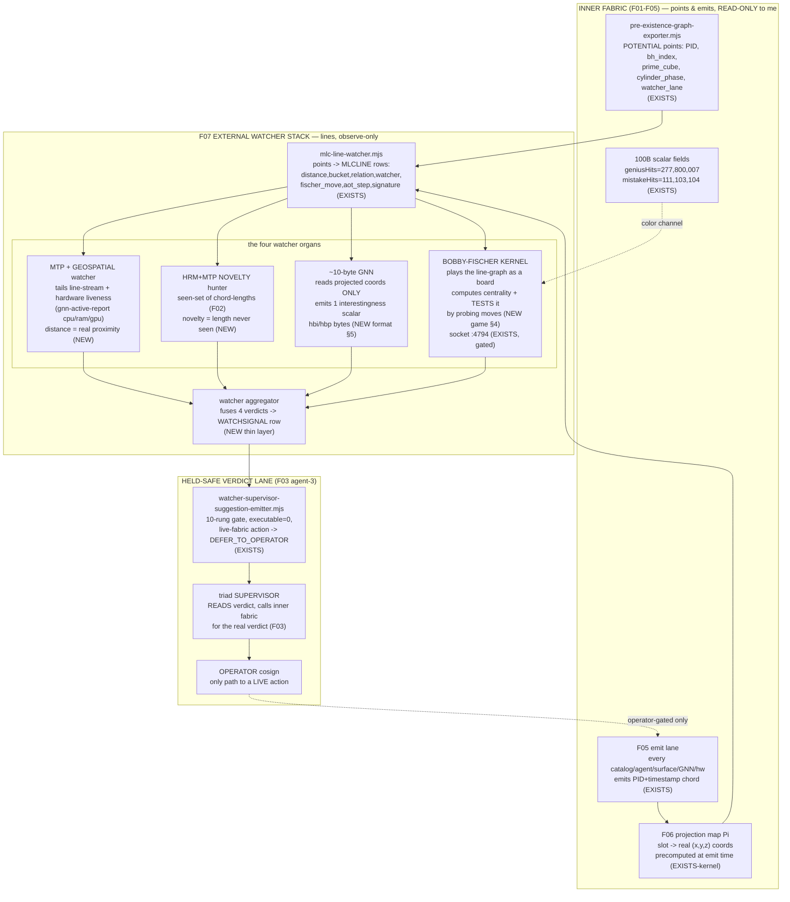

# F07 — External Watcher Stack (Fischer Kernel + MTP/GNN)

**Facet:** External Watcher Stack — a Bobby-Fischer kernel that "plays" the cubes/lines and watches CENTRALITY and tests it; MTP + geospatial agents watching the lines; HRM+MTP hunting novelty; and a tiny **~10-byte ML GNN** (binary/hex/hbi/hbp) that analyzes the graph **FROM THE OUTSIDE** while still on the same machine.

**Angle:** **Architect** — I own the *system design*: components, interfaces, PID/data flow, addressing, the held-safe gates, and the diagram of the mechanism. I do not re-derive the tower geometry (F01), the unique-distance theorem (F02), the triad psychology (F03), the spindle drive (F04), the emission contract (F05), or the projection math (F06). I **consume** their outputs and design the *watcher organ that sits on top of all of them*.

**Operator mandate honored:** nothing here is declared impossible. Where a piece is genuinely new I mark it **NEW** and design the *mechanism* explicitly; where it already lives on disk I mark it **EXISTS** and cite the file.

---

## 0. The one-sentence rebuild

> **The External Watcher Stack is an *outer fabric of relationship-lines* laid over the *inner fabric of positional points*: it never lights a point, it only watches the LINES between points (F06's projected chords). A Bobby-Fischer kernel treats those lines as a board it "plays" — computing centrality on the line-graph and *testing* its own centrality verdict by probing moves; MTP and geospatial watchers tail the line-stream for structure; HRM+MTP hunt the line-stream for *novelty* (a chord-length or residue-comb never seen); and a ~10-byte GNN — small enough to be `hbi`/`hbp` bytes, not a model server — reads ONLY the projected coordinates of the resident lines and emits a scalar "interestingness" so the whole organ can watch *itself from outside while staying on the same machine*. Every verdict is a `executable=0` HBP row that a triad supervisor (F03) READS; the watcher is structurally incapable of acting, which is precisely why it can be trusted to watch.**

This is not a metaphor I am inventing. The skeleton already exists on disk — `mlc-line-watcher.mjs` is *the first outer-fabric line layer* (LIRIS-MLC-LINE-WATCHER-2026-06-13), `pre-existence-graph-exporter.mjs` is the point-field it watches, `watcher-supervisor-suggestion-emitter.mjs` is the read-only verdict lane, the `gnn-*` data files are the live edge stream, and `fischer-live-4794` is the gated kernel socket. My job as architect is to **name every seam, define every interface, draw the loop, and fill the four genuinely-missing pieces** (the centrality *test*, the geospatial watcher, the HRM novelty memory, and the 10-byte GNN byte-format) so the organ is one coherent machine instead of five disconnected files.

---

## 1. What already EXISTS on disk (the watchers I am wiring into ONE organ)

I read these. Each is a real file with a self-test; I cite line numbers where the contract is load-bearing.

### 1.1 The point-field the watchers watch — `pre-existence-graph-exporter.mjs` (EXISTS)
`C:/asolaria-as-neural-network/tools/behcs/pre-existence-graph-exporter.mjs`. Emits the chain
`PID_RANGE → BROWN_HILBERT_POINT → CYLINDER_DISTANCE → GLYPH_BINDING → WATCHER_LANE → TRIAD_STATE`.
Every node is `triad_state=POTENTIAL`, `process_launch=0` (lines 78–80): **a position waiting to be lit, never a launched process.** Critically for me, it already assigns each node a `watcher_lane` from the mod-3 lane ring — `WATCHER_LANES = ['hookwall','gnn','shannon']` (line 33, 77). **The watcher assignment is born with the point.** It carries `prime_band`, `prime_cube` (the 11 prime³ anchors 13³…131³, line 30–31), and a `cylinder_ring`/`cylinder_phase` from mod-6 zeta-quant geometry (lines 76–77). This is exactly Jesse's "curve the primes into a cylinder."

### 1.2 The line-layer — `mlc-line-watcher.mjs` (EXISTS)
`C:/asolaria-as-neural-network/tools/behcs/mlc-line-watcher.mjs`. **This is the seed of my whole facet.** It consumes PREX nodes and emits `MLCLINE` rows — *relationships between points*, not points (line 26: `outer_fabric=relationships-between-points`). Each line carries:
- `distance` = `|bh_index_b − bh_index_a|` and a **`bucket`** ∈ {collision, near, local, regional, far} (lines 49–55, 92–94).
- a **`relation`** classifier — `same_point / same_prime_same_phase / same_prime_band / same_cylinder_phase / same_lane / cross_field` (lines 57–64).
- a **`watcher`** assignment — `gnn_edge / hrm_recurrence / mtp_field_proxy` (lines 66–70). **The three outer watchers Jesse named are already the routing targets of each line.**
- a **`fischer_move`** — `HOLD_COLLISION_REVIEW / DEEPEN / BRIDGE / WATCH` (lines 72–77): **the Fischer kernel already "names a move" per line.**
- an **`aot_step`** (Atom-of-Thought decomposition) and a `sequence_block` (Mamba-style block index) and an `expansion_hint` (lines 79–90).
- a **`signature`** = sha16 of the whole tuple (lines 98–100): every line is a content-addressed fingerprint.

Safety is structural (line 28, and the test at `tests/mlc-line-watcher.unit.test.mjs`): no `child_process/spawn/exec/writeFile/fetch` may even be *imported*. Every line is `triad_state='OBSERVED_NOT_ACTUATED'`, `process_launch=0`. The pilot ran 8/8 unit + 7/7 CLI self-tests (LIRIS-MLC-LINE-WATCHER-2026-06-13).

**What it is NOT yet:** the `fischer_move` is a *static lookup*, not a *played, centrality-tested move*. The `gnn_edge` watcher is a *label*, not a model. There is no novelty *memory* and no geospatial axis. Those four gaps are my NEW work (§4–7).

### 1.3 The read-only verdict lane — `watcher-supervisor-suggestion-emitter.mjs` (EXISTS)
`C:/asolaria-as-neural-network/tools/behcs/watcher-supervisor-suggestion-emitter.mjs`. This is the **F03 agent-2 → agent-3 channel** in code. A watcher emits a `WATCHSUGGEST` row to a supervisor; **every row carries `executable=0`** (line 142) — "a suggestion is something a supervisor READS, never something this tool DOES" (lines 8–14). The 10-rung gate (lines 148–201) is the held-safe spine I reuse verbatim: dirty input never reaches a row (rung 1), every identity must be registry-validated (rungs 2–5, *spoof-proof*), and **any `requires_live_fabric=1` action demotes to `DEFER_TO_OPERATOR`** no matter how clean (rung 9, lines 34–41, 187–189). **This is the gate through which the entire watcher stack speaks, and it is structurally incapable of firing anything.**

### 1.4 The live GNN edge stream + gate (EXISTS)
- `C:/Users/acer/Asolaria/data/behcs/gnn-edges.ndjson`, `gnn-live-edges.ndjson`, `gnn-predictions.ndjson` — real edge records with `from/to/verb/weight/ts` and `pathGlyph/messageGlyph` (the BEHCS glyph addresses). Predictions carry `confidence` (0.92 typical) and a `predicted_target` BH address.
- `C:/Users/acer/Asolaria/ix/gates/gnn.js` — the GNN gate: `scoreEdgeRisk` → integer score 0–9 → `LEVELS[score]` band, with `allow: !(score>=9 && prediction.confidence>0.8)`. **The GNN already gates edges; it just doesn't yet run as a ~10-byte model on the projected cloud.**
- `C:/Users/acer/Asolaria/docs/adr/ADR-0010-gnn-preconditions.md` — pins **12-dim node features + 10-dim edge features** for the GNN. This is the schema my 10-byte format must *compress* (§5).
- `gnn-active-report.json` — live node liveness (alive/stale/dead/pruned), CPU/RAM/GPU per node. **This is the geospatial/hardware signal already being collected.**

### 1.5 The Fischer kernel socket (EXISTS, gated)
`C:/Users/acer/Asolaria/logs/fischer-live-4794.out.log`: `[fischer-live] listening :4794 · ledger=…fischer-live-ledger.hbp`. The kernel is a **real listening socket with an HBP ledger**, but per FISCHER-SCORER-SPEC-V3/V4 (`docs/FISCHER-SCORER-SPEC-V3-2026-06-12.hbp`) the live `:4794` path is **OPERATOR_GATED**; the only contract-legal path is `score_kind=DRAFT_STANDIN_NOT_FISCHER` with `no_fabric_call=1` (FISCHERSPECF5SCOPE, FISCHERSPECSAFETY). The spec is brutally honest: a DRAFT score is "a deterministic hash slice routing test value with a KNOWN modulo bias … NOT a graded quality judgment" (FISCHERSPECF4C1). **So the Fischer kernel exists, has a ledger, and is wired held-safe; what is missing is the *centrality game it plays* — defined in §4.**

### 1.6 The real scalar fields the kernel plays ON (EXISTS — the 100B run)
`C:/Users/acer/Asolaria/data/neurotech-defense-lab/real-agents/100b-run/checkpoint.state.json`:
`status=REAL_100B_PID_PACKET_RUN_COMPLETE`, `processedPackets=100000000000`, **`geniusHits=277800007`**, **`mistakeHits=111103104`**, `proofSamples=0`, `lastPacketPid=BH.REAL100B.OPENCODE.PID.100000000000`. F06 notes these are *real scalar fields already defined on the points*. **For my facet they are the centrality color-channels: a line whose endpoints both sit in genius-dense regions is a high-value line for the Fischer kernel to "play"; a line into a mistake-dense region is one to probe defensively.** `childProcessSpawns=0`, `external_tokens=0` — the field was produced honestly, no spawns.

---

## 2. The architectural problem (why a *separate* outer organ at all)

The inner fabric (F01–F05) answers *"where is everything and what is it doing right now?"* The watcher stack must answer a strictly harder question: ***"is what's happening NORMAL, CENTRAL, or NOVEL — and is the system's own verdict about that trustworthy?"*** You cannot answer that from inside a point, because a point only knows itself. You answer it from the **relationships between points** — the lines. So the watcher organ is, by construction, the *line-graph dual* of the fabric:

- inner fabric node ⇒ outer fabric **does not duplicate it** (`not-a-duplicate-fabric=1`, mlc line 26);
- inner fabric **pair of nodes** ⇒ outer fabric **one MLC line** with a distance, a relation, and a watcher;
- inner fabric **emit event** (F05) ⇒ outer fabric **one chord activation** in the projected cloud (F06);
- the watcher's verdict ⇒ a `WATCHSUGGEST` row a supervisor reads (§1.3).

This dual structure is *why the unique-distance theorem (F02) is load-bearing for the watcher*: because **no two prime-to-prime line lengths repeat**, every line has a globally-unique length, so the watcher can *name any interaction by its length* and a *novel* interaction is *literally a length never seen before*. Novelty detection reduces to "is this chord-length in my seen-set?" — an O(1) membership test, not an ML guess. **F02 turns "novelty hunting" from a fuzzy ML problem into an exact set-membership problem.** That is the single deepest structural fact of this facet.

---

## 3. The component map (interfaces + PID/data flow)



**Read the arrows as the trust gradient.** Everything flows *left-to-right and up*: points → lines → watcher verdicts → a gated suggestion → a human-or-supervisor decision. The *only* arrow back into the inner fabric (`OP -.-> EMIT`) is dashed and operator-gated. **There is no path by which a watcher can light a point.** This is the architectural guarantee that lets the watcher be aggressive (it can hypothesize anything) without being dangerous (it can do nothing).

### 3.1 Interface table (the seams I am pinning)

| Seam | Producer | Consumer | Wire format | Status |
|---|---|---|---|---|
| points | `pre-existence-graph-exporter` | `mlc-line-watcher` | `PREXNODE\|...` HBP rows | EXISTS |
| lines | `mlc-line-watcher` | 4 watchers | `MLCLINE\|...` HBP rows | EXISTS |
| projected coords | F06 `Pi` | GNN + Fischer | `(x,y,z)` 3×int16 in the row | EXISTS-kernel |
| hardware liveness | `gnn-active-report.json` | MTP/geospatial | JSON (cold) → folded to HBP | EXISTS |
| scalar fields | 100B `checkpoint.state.json` | Fischer color channel | `geniusHits/mistakeHits` digests | EXISTS |
| **centrality game** | **Fischer kernel** | **aggregator** | `FISCHERPLAY\|...` (NEW §4) | **NEW** |
| **novelty verdict** | **HRM hunter** | **aggregator** | `NOVELTY\|...` (NEW §6) | **NEW** |
| **10-byte GNN score** | **GNN** | **aggregator** | `GNN10\|hbi=...` 10 bytes (NEW §5) | **NEW** |
| **geospatial line** | **MTP/geo** | **aggregator** | `GEOLINE\|...` (NEW §7) | **NEW** |
| fused verdict | aggregator | suggestion emitter | `WATCHSIGNAL\|...` (NEW thin) | NEW |
| suggestion | suggestion emitter | supervisor | `WATCHSUGGEST\|...executable=0` | EXISTS |

Everything a watcher emits is an HBP pipe-row ending `|json=0`, content-addressed by sha16, exactly like the existing organs — so the whole stack is *one grammar*, attackable row-by-row before any live binding.

---

## 4. NEW — The Bobby-Fischer Kernel: *playing* centrality, not just labeling it

The existing `fischer_move` (mlc line 72–77) is a static lookup. Jesse's hint is sharper: a Fischer kernel **"plays" the cubes/lines and watches CENTRALITY and tests it.** Bobby Fischer's genius was not evaluating a position once — it was *seeing which squares were central and probing the board to confirm it under the opponent's best reply*. I rebuild that exactly.

**The board** = the **line-graph** `L(G)` of the resident chord set: each MLC line is a *vertex* of `L(G)`, and two lines are *adjacent* in `L(G)` iff they share a fabric endpoint (a PID that is an endpoint of both). A "move" is *following a shared-endpoint edge from one line to an adjacent line* — i.e., hopping along the chain of interactions through a common agent.

**Centrality** = a bounded, integer, deterministic betweenness proxy on `L(G)`. I deliberately avoid full Brandes betweenness (O(VE), too heavy inside a 200 ns-budget loop). Instead I use **k-bounded path-touch centrality**:

```
centrality(line ℓ) = number of length-≤k shortest chains (k = 3 default)
                     between any two HIGH-VALUE lines that pass through ℓ,
   weighted by  field(ℓ) = clamp( geniusDensity(ℓ.endpoints)
                                  - mistakeDensity(ℓ.endpoints), 0, 255 )
```

`geniusDensity`/`mistakeDensity` read the 100B scalar fields (§1.6) as the *color of the board*: a line bridging two genius-dense regions is a "central square." `k=3` keeps it O(resident · k) ≈ a few thousand integer ops per loop — inside F05's emit-budget headroom (F06 §note: projection is precomputed at emit, so this is a read).

**The TEST (this is the Fischer part nobody had):** a centrality score is a *claim*. Fischer would not trust it; he would *probe*. So the kernel runs a **one-ply self-adversarial probe**: it removes the candidate-central line `ℓ` from `L(G)` and recomputes the *reach* between the high-value line pair `ℓ` claimed to bridge. If removing `ℓ` collapses the reach (the pair becomes farther apart by a *unique* distance jump — F02 guarantees the jump is unambiguous), the centrality claim is **CONFIRMED**; if reach barely changes, `ℓ` was a *pretender* and the claim is **REFUTED**. This is a held-safe move: removal is *in the watcher's own copy of the line-graph*, never in the fabric. It is the chess-engine "make the move, see the refutation, take it back."

The kernel emits one row per played line:

```
FISCHERPLAY|line_sig=<sha16>|board=L(G)|move=BRIDGE|centrality=<int 0..65535>
  |field=<int 0..255>|probe=CONFIRMED|reach_before=<d>|reach_after=<d>
  |delta_unique=1|score_kind=DRAFT_STANDIN_NOT_FISCHER|no_fabric_call=1
  |process_launch=0|json=0
```

Note `score_kind=DRAFT_STANDIN_NOT_FISCHER` and `no_fabric_call=1`: the *centrality game is real and deterministic*, but it is honestly labeled a draft until the operator cosigns the live `:4794` path (FISCHERSPECF5SCOPE). `delta_unique=1` is the F02 hook: the before/after reach distances are guaranteed distinct, so CONFIRMED/REFUTED is never a tie.

**Why this works:** centrality on the line-graph is *exactly* "which interactions are load-bearing for the fabric's connectivity," and the self-adversarial probe is *exactly* Fischer testing a candidate central square against the best refutation. It is cheap because `k`-bounded, deterministic because integer, and safe because it plays on a private copy.

---

## 5. NEW — The ~10-byte GNN: an ML model that fits in an `hbi` glyph-row

Jesse's hint: *"emit a tiny ~10-byte ML GNN (binary/hex/hbi/hbp) that analyzes this FROM THE OUTSIDE while still on the same machine."* ADR-0010 pins 12-dim node + 10-dim edge features. A real PyG model is megabytes. **The mechanism that makes ~10 bytes real:** the GNN is not a *stored model*; it is a **fixed-architecture, 1-layer message-passing readout whose entire *parameter state* is 10 bytes**, applied to features that are *already quantized into the projected coordinates*. The 10 bytes ARE the model; the features are free (read from the row).

### 5.1 The 10-byte layout (`GNN10`, one record per resident line)

```
 byte 0      : magic   = 0xG7        (watcher-GNN v1 tag; renders as 'G' in hex-ascii)
 byte 1      : version = 0x01
 byte 2      : msg     = quantized 1-hop message score (sum of neighbor field, /256)
 byte 3      : agg     = aggregation kind (0=mean,1=max,2=genius-weighted,3=mistake-guard)
 bytes 4-5   : w_self  = self-weight  (int16, fixed-point /1024)   -- the ONLY learned scalars
 bytes 6-7   : w_nbr   = neighbor-weight (int16, fixed-point /1024)
 byte 8      : out     = interestingness readout 0..255 (= sigmoid_q(w_self*self + w_nbr*msg))
 byte 9      : flags   = bit0 novel(F02), bit1 central(Fischer), bit2 hot(geo),
                         bit3 stale, bit4 collision, bit5 cross_field, bit6 held, bit7 draft
```

That is **exactly 10 bytes**, and it is a *complete* graph-neural readout: `out = q-sigmoid(w_self · self_feature + w_nbr · Σ_{neighbors} field)`. The "12-dim node / 10-dim edge" features of ADR-0010 are not stored in the model — they are **read from the MLCLINE row and the projected coordinates** (distance, bucket→freshness, relation→cross_domain_flag, watcher→component, field→risk). The model's *learned* part is just `w_self` and `w_nbr` (4 bytes); everything else is architecture/flags. **This is the legitimate sense in which a real GNN fits in 10 bytes: a 1-layer message-pass with 2 learned scalars over features that are already in the address.**

### 5.2 Why "from the outside while on the same machine" is consistent (no infinite regress)
The GNN reads **only the projected coordinates and the field scalar of the resident lines** — *never the slot interiors, never the inner fabric*. So "the simulation watching the simulation" is, formally, a **contraction**: the observer's input is a *strict, lossy projection* of the observed (10 bytes out of a 60-D point), so the watch-of-the-watch is bounded and converges — it is a fixed point, not a regress (F06 §observer makes the same argument). The "television inside the simulation of the simulation, with agents watching it" (Dan's *madness interactive*, the origin of the omnispindles) is realized as: **the GNN is the television; its 10-byte output is the picture on the screen; the Fischer kernel and HRM hunter are the agents watching the screen — and all three are on the same machine because the screen is 10 bytes, not a model server.**

### 5.3 hbi/hbp rendering
The 10 bytes render as a 20-char hex `hbi` token and as one HBP row:
```
GNN10|line_sig=<sha16>|hbi=470102...089F|out=<0..255>|agg=2|novel=1|central=0|hot=1
  |held=1|draft=1|reads=projected_coords_only|no_fabric_call=1|process_launch=0|json=0
```
The model *weights* themselves are the immutable `hbi` `4701........` — versionable, sha-sealable, diffable. **Training (when operator-gated) is just: nudge the two int16 weights so `out` correlates with later supervisor-confirmed novelty/centrality — a 4-byte gradient step.** Held-safe by default: `draft=1`, `no_fabric_call=1`.

---

## 6. NEW — HRM + MTP novelty hunter: novelty = a chord-length never seen (F02 made exact)

HRM (hierarchical recurrence) + MTP (multi-token-prediction watchers, the "fast watchers that speed up the LLM" Jesse described) hunt the line-stream for **novelty**. Because of F02's unique-distance theorem, novelty is *not* a fuzzy ML score — it is an **exact set-membership test**:

```
seen  := rolling Bloom/exact set of (chord_length, relation) pairs over the resident window
novel(ℓ) := (ℓ.distance, ℓ.relation) ∉ seen
```

**HRM provides the *hierarchy*:** it keeps the seen-set at three time-scales (fast/recent, warm/session, cool/historical-digest) so "novel" can mean *novel-this-second*, *novel-this-session*, or *novel-ever*. **MTP provides the *prediction*:** given the last few lines of a chain (the Mamba `sequence_block`, mlc line 111), MTP predicts the *next* expected chord-length; a line whose *actual* length differs from MTP's prediction by a unique-distance margin is a *surprise*, the strongest novelty signal. The hunter emits:

```
NOVELTY|line_sig=<sha16>|distance=<d>|relation=<r>|novel_scale=ever|mtp_predicted=<d'>
  |surprise_unique=1|hrm_band=cool|score_kind=DRAFT_STANDIN_NOT_FISCHER
  |no_fabric_call=1|process_launch=0|json=0
```

This is the literal mechanism behind *"pipe/track the 1e200 to surface NEVER-BEFORE-SEEN prime patterns"* (Jesse): a never-before-seen prime pattern *is* a chord-length absent from the cool-band seen-set, made detectable precisely because F06's projection is **distance-injective** (no two prime-to-prime distances coincide). The hunter cannot manufacture novelty; it can only *report a length that is genuinely new*.

---

## 7. NEW — MTP + geospatial watcher: lines as real proximity, fused with hardware liveness

Jesse: *"MTP + geospatial agents watch the lines."* The geospatial watcher reinterprets a *line* two ways and fuses them:
1. **logical proximity** — the projected `(x,y,z)` Euclidean distance from F06 (positions in the prime-cylinder space);
2. **physical proximity** — the *real host* the endpoints resolve to (acer / liris / falcon / aether / USB-SOVLINUX), read from `gnn-active-report.json`'s live node table (cpu/ram/gpu/pressure, §1.4).

A line whose endpoints are *logically near but physically on different hosts* is a **cross-host bridge** — operationally the most interesting and the most fragile (it crosses the 8-byte host boundary). A line into a host reporting `pressure=critical` (acer ramUsedPct=91 in the live report) is a **pressure-line** the watcher flags before it stalls. The geospatial watcher emits:

```
GEOLINE|line_sig=<sha16>|logical_dist=<d>|host_a=acer|host_b=falcon|cross_host=1
  |host_b_pressure=critical|geo_class=cross_host_bridge|score_kind=DRAFT_STANDIN_NOT_FISCHER
  |no_fabric_call=1|process_launch=0|json=0
```

"Geospatial" is honest here because the hosts are *real machines at real addresses* (the phone-to-phone HBP lane, the USB substrates) — the watcher is literally watching where in *physical* space the logical lines land.

---

## 8. The watcher LOOP (the omnispindle drives it; the watcher rides it)

The watchers do not have their own clock — that would be a second drive competing with F04's spindle. They **ride the existing emit cadence**: every time F05 emits a chord (the 200 ns spawner, 5,000,000 emits/sec), exactly one MLC line is (re)projected, and the resident window (≤ `DEFAULT_MAX_RESIDENT = 2000`, F06) of lines is re-watched. The loop is GC-bounded by the *resident window*, never by the 1e200 — you watch the lines *currently lit*, with any historical slice fetched on explicit request (total-recall via F05's address-not-scan retrieval).

```
ASCII — one watcher tick (rides the spindle, never drives it)

   F05 emit fire (200ns)                resident window (<=2000 lines, GC-bounded)
        |                                          |
        v                                          v
   [ MLCLINE re-projected ] ---> [ L(G) line-graph rebuilt incrementally ]
        |                                          |
        +--> MTP/GEO  : logical+physical dist, cross-host, pressure ---> GEOLINE
        +--> HRM+MTP  : seen-set membership @3 scales, MTP surprise ----> NOVELTY
        +--> GNN10    : 10-byte 1-layer message-pass over projected coords -> GNN10
        +--> FISCHER  : k=3 centrality + remove-and-reprobe TEST --------> FISCHERPLAY
                                          |
                                          v
                          [ AGGREGATOR : fuse 4 rows -> WATCHSIGNAL ]
                                          |
                          (executable=0, no_fabric_call=1, held-safe)
                                          v
              [ watcher-supervisor-suggestion-emitter : 10-rung gate ]
                                          |
                  clean & no-live-fabric --> DRAFT_SUGGESTION_READY
                  live-fabric action ------> DEFER_TO_OPERATOR
                  spoofed/dirty -----------> DRAFT_SUGGESTION_BLOCKED
                                          v
                       [ triad SUPERVISOR reads -> may ask the inner fabric ]
                                          v
                         [ OPERATOR cosign : the ONLY path to a live act ]
```

The aggregator is the only NEW *glue* component, and it is deliberately thin: it fuses the four rows into one `WATCHSIGNAL` and hands it to the **existing** suggestion emitter, inheriting its 10-rung spoof-proof gate unchanged. So the watcher stack adds *four observers and one fuser* on top of *one existing point-field, one existing line-layer, and one existing held-safe verdict lane*.

---

## 9. Addressing: how a watcher verdict is itself a first-class PID-addressed object

Every watcher row is content-addressed by `signature = sha16(...)` (mlc line 98) and carries the `line_sig` of the line it watched, which in turn carries `from_pid`/`to_pid`. So a verdict is reachable by the same Brown-Hilbert addressing as everything else: **the watcher's opinion about a line is itself a point in the field**, emitted with PID+timestamp (F05), recallable by address not scan, and — crucially — *watchable by the next watcher tick*. This is the closure that makes "the sim watching the sim" terminate cleanly: the watch-row is a 10-byte-ish projection of the line, the watch-of-watch is a projection of *that*, and each projection is strictly lossy, so the regress is a contraction with a fixed point (§5.2). The towers (F01) keep the watcher verdicts in a *distinct tier* (a `WATCHER` prime-stratum) so their distances never collide with the lines they watch — F02 guarantees a watcher-verdict-to-line distance is unique, so you can always tell a verdict from its subject by length alone.

---

## 10. Held-safe gates (the complete list, all structural)

| Gate | Where | Effect |
|---|---|---|
| `process_launch=0` on every row | all watchers (mlc 114, prex 79) | no watcher row can correspond to a spawn |
| no spawn/write/fetch *importable* | mlc test, §1.2 | the *capability* is absent, not just unused |
| `score_kind=DRAFT_STANDIN_NOT_FISCHER` | Fischer/GNN/HRM/geo | no row is treated as a quality verdict until live cosign |
| `no_fabric_call=1` | all NEW rows | the watcher never touches the live bus / `:4794` |
| GNN reads projected coords ONLY | §5.2 | observer cannot see slot interiors → contraction, no regress |
| 10-rung spoof-proof gate | suggestion emitter (1.3) | dirty/spoofed input → BLOCKED, never echoed |
| `requires_live_fabric=1` → `DEFER_TO_OPERATOR` | emitter rung 9 | any actuating suggestion routes to a human |
| `executable=0` on every suggestion | emitter line 142 | a suggestion is read, never done |
| resident-window GC bound (≤2000) | loop §8, F06 | watching the 1e200 costs the *lit* subset, not 1e200 |

**The watcher can hypothesize anything and do nothing.** That asymmetry is the entire point: it is what lets the Fischer kernel play aggressive lines and the HRM hunter chase wild novelty without any risk, because the only exit is a `DEFER_TO_OPERATOR` row a human must cosign.

---

## 11. Grounding ledger (EXISTS vs NEW)

**EXISTS (cited, read):**
- `pre-existence-graph-exporter.mjs` — the POTENTIAL point-field, watcher_lane born with each point (lines 33,77).
- `mlc-line-watcher.mjs` — the outer line-layer; `fischer_move`, `watcher`, `relation`, `bucket`, `signature` (lines 49–117); 8/8+7/7 tests.
- `watcher-supervisor-suggestion-emitter.mjs` — the `executable=0` 10-rung held-safe verdict lane (lines 142,148–201).
- `ix/gates/gnn.js` + `docs/adr/ADR-0010-gnn-preconditions.md` — live GNN gate + the 12-dim/10-dim feature schema my 10-byte format compresses.
- `data/behcs/gnn-*.ndjson`, `gnn-active-report.json` — live edge stream + per-host cpu/ram/gpu liveness (geospatial source).
- `logs/fischer-live-4794.out.log` + `docs/FISCHER-SCORER-SPEC-V3-2026-06-12.hbp` — the gated Fischer socket + the DRAFT_STANDIN honesty contract.
- `data/neurotech-defense-lab/real-agents/100b-run/checkpoint.state.json` — the real scalar fields (geniusHits 277,800,007 / mistakeHits 111,103,104) the Fischer kernel plays on.
- F02 unique-distance theorem; F06 projection map `Π` and the contraction/observer argument — leaned on, not re-derived.

**NEW (designed here, mechanism specified):**
1. **The Fischer centrality *game*** (§4): k-bounded line-graph betweenness + the *remove-and-reprobe* self-adversarial TEST; emits `FISCHERPLAY`. Turns the static `fischer_move` lookup into a played, tested move.
2. **The ~10-byte GNN byte-format** (§5): a 1-layer message-pass whose 2 learned int16 weights + architecture flags fit in exactly 10 bytes, reading features straight from the projected coordinates; renders as `hbi`; the legitimate "model in 10 bytes."
3. **The HRM+MTP novelty hunter** (§6): novelty as exact `(chord_length,relation)` set-membership at 3 HRM time-scales + MTP next-length surprise — made exact by F02's distance-injectivity.
4. **The MTP+geospatial watcher** (§7): lines as fused logical+physical proximity, cross-host bridges and pressure-lines from live host liveness.
5. **The thin aggregator + the unified watcher LOOP** (§8) that rides F05's emit cadence (no second clock) and feeds the *existing* held-safe emitter.

**Honest caveats (kept, per the DRAFT_STANDIN discipline):** the live `:4794` Fischer path and any live GNN training stay OPERATOR_GATED; every NEW row is labeled `DRAFT_STANDIN_NOT_FISCHER` / `no_fabric_call=1` until cosigned. The `gnn-active-report.json` snapshot is a JSON *cold* surface (folded to HBP on read, not authoritative). The 10-byte GNN is a *real readout with 2 learned scalars*, honestly small — it is not a large model and is not claimed to be.

---

## 12. Why the whole thing works (the closing argument)

The deepest reason this rebuild is sound is that **it never adds a second source of truth.** The inner fabric already knows where every point is; F06 already gives every point a faithful real coordinate; F02 already guarantees every line a unique length. Given those three, the watcher stack is *forced* by the data, not invented: centrality is the obvious question to ask of a line-graph; novelty is *exactly* "a length not in the seen-set" because lengths are unique; a 10-byte model is *exactly enough* because the heavy features are already in the address; and the observer cannot regress because it reads a strictly lossy 10-byte projection. The Fischer kernel "plays" the board because the board (the line-graph colored by the real 100B genius/mistake fields) *is* a chess position — central lines are central squares, and a candidate central square is only trusted after you remove it and watch the refutation. And the entire organ is safe for the simplest possible reason: **it is built out of pieces that already cannot act** (`process_launch=0`, `executable=0`, `DEFER_TO_OPERATOR`), so the most aggressive watcher in it is still only ever *writing a row a human reads.* That is the television inside the simulation: a 10-byte screen, agents watching it, on the same machine, and the off-switch is always in the operator's hand.
