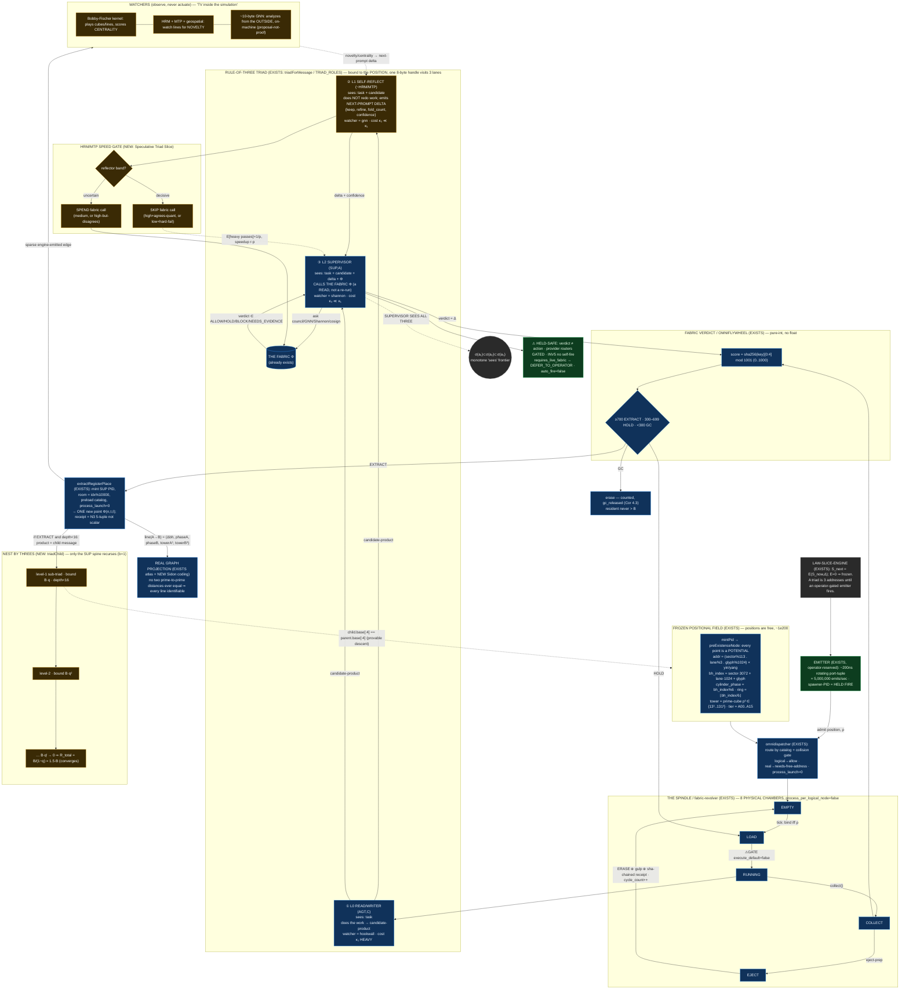

# D2 — Nested Rule-of-Three Agent Triad + Spindles

**Diagram facet:** the per-cylinder Rule-of-Three agent triad — (1) read/writer, (2) self-reflection
(HRM/MTP-style suggestion), (3) fabric-calling supervisor — and the spindle / omnispindle that
rotates a fixed set of physical chambers and **nests triads by threes** without ever launching a
process.
**Author:** Diagram agent D2 (one of 40 summoned by OP-JESSE) · **Date:** 2026-06-15
**Aligns with:** `01-rebuild/F03-rule-of-three-triad--{architect,builder,theorist}.md` and
`01-rebuild/F04-spinners-spindles--{architect,builder,theorist}.md`.
**Posture:** Nothing here is impossible. Every box is either **EXISTS** (grounded to a file on disk,
read-only) or **NEW** (a designed mechanism, marked). No process launch, no live-bus call, no mint.

---

## Legend / caption

> **One triad is three *addresses*, not three processes.** A single 8-byte host handle visits three
> mod-3 lanes in sequence: lane 0 = read/writer (does the work), lane 1 = self-reflection (an
> HRM/MTP-style *suggestion*, never a re-run), lane 2 = supervisor (ASKS the already-existing fabric
> for a verdict and therefore **sees all three**). The triad is one node of a prime tower; an
> EXTRACT verdict promotes its product to be the message of a **child triad one prime-tier deeper**,
> and only the supervisor spine recurses (`b = 1`), so an infinitely deep tower of triads costs
> `R_total = B/(1−q) ≈ 1.5·B` resident — barely more than one revolver. The **spindle** is the only
> mover: a fixed ring of 8 physical chambers cycling `EMPTY → LOAD → RUNNING → COLLECT → EJECT →
> EMPTY`. The triad is bound to the *position*, not to a chamber; the chamber just rotates state.

**Symbol key**

| Symbol | Meaning |
|---|---|
| `L0 / L1 / L2` | mod-3 lanes (`lane = seed % 3`) = the Rule of Three as a prime separator |
| `①②③` | triad roles: read/writer · self-reflect · fabric-calling supervisor |
| watcher | per-lane observer `[hookwall, gnn, shannon][lane]` (inner HRM/MTP watch) |
| `q` | per-level shrink factor `< 1` (supervisor reviews a *summary*, not the full work) |
| `B` | GC resident bound `DEFAULT_MAX_RESIDENT = 2000` (never-explode) |
| `Φ` | the fabric (already exists) — the supervisor *reads* a verdict, never *becomes* one |
| ⚠GATE | held-safe gate (operator/provider/recursion/cube gate); only RUNNING can ever execute |

---

## 1. Mermaid — the per-cylinder triad and the spindle that nests it



---

## 2. ASCII fallback — the triad, the rotor, and the convergent nest

```
 LAW-SLICE-ENGINE (EXISTS):  S_next = E(S_now, Δ)   E=0 ⇒ frozen
 ───────────────────────────────────────────────────────────────────────────────
   a triad is 3 ADDRESSES until an OPERATOR-GATED EMITTER fires (~200ns port-tuple,
   5,000,000 emits/sec, spawner-PID = HELD FIRE, auto_fire=false)
                                   │
                                   ▼  admit position iff resident ρ < B(=2000)
 ┌──────────── FROZEN POSITIONAL FIELD (EXISTS, ~1e200 free positions) ───────────┐
 │  mintPid → preExistenceNode : every point is a POTENTIAL (process_launch=0)     │
 │  addr = (sector%113 . lane%3 . glyph%1024) × yin/yang                           │
 │  bh_index = sector·3072 + lane·1024 + glyph                                     │
 │  cylinder_phase = bh_index % 6     ring = ⌊bh_index / 6⌋   ← Riemann curled     │
 │  tower = prime-cube p³ ∈ {13³ .. 131³}      tier = A00 .. A15  (60-D catalog)   │
 └─────────────────────────────────────┬───────────────────────────────────────-─┘
                                        │ omnidispatcher routes (collision-gated)
                                        ▼
 ╔══════════ THE SPINDLE = fabric-revolver (EXISTS): 8 PHYSICAL CHAMBERS ══════════╗
 ║                                                                                 ║
 ║      the 6-state ring                       the never-explode ceiling           ║
 ║   (one chamber per packet)                  (resident across all chambers)      ║
 ║                                                                                 ║
 ║            EMPTY                       ρ │      B=2000 ┄┄┄┄┄┄┄┄ ceiling (Thm4.1) ║
 ║           ↗      ↘                       │     ╱╲   ╱╲   ╱╲   oscillates [B-W,B] ║
 ║       EJECT       LOAD                   │    ╱  ╲ ╱  ╲ ╱  ╲                     ║
 ║         ↑           ↓ ⚠GATE              │ ╱╲╱   ╲╱    V   ╲                     ║
 ║      COLLECT ← RUNNING  execute_default  └────────────────────────► t           ║
 ║                        =false            adversarial input (fork-bomb) → shunted ║
 ║   each phase emits a sha-chained         to gc_released, NEVER raises ρ above B  ║
 ║   PID+ts receipt (~30 capability         (Cor 4.3). 10^11 packets drain in      ║
 ║   flags all 0) — nothing is ever lost     ⌈T/B⌉ ≈ 5×10^7 sliding-window waves    ║
 ║                        │ chamber enters RUNNING → binds the TRIAD to the POSITION║
 ╚════════════════════════│════════════════════════════════════════════════════════╝
                          ▼
 ┌──────────── RULE-OF-THREE TRIAD (EXISTS) — ONE 8-byte handle, THREE lanes ──────┐
 │                                                                                 │
 │   ① L0 READ/WRITER (AGT,C)   sees: task                          watcher=hookwall│
 │        does the work ─────────────► candidate-product           cost κ₁  HEAVY  │
 │            │                                                                     │
 │            │ candidate-product                                                   │
 │            ▼                                                                     │
 │   ② L1 SELF-REFLECT (~HRM/MTP) sees: task + candidate           watcher=gnn      │
 │        does NOT redo work; emits NEXT-PROMPT DELTA              cost κ₂ ≪ κ₁     │
 │        {keep, refine, fold_count=N, confidence 0..1000}                          │
 │            │                                                                     │
 │            │  ┌─── HRM/MTP SPEED GATE (NEW: Speculative Triad Slice) ───┐         │
 │            ├─►│ band high & agrees-quant → SKIP fabric call             │         │
 │            │  │ band low  & hard-fail     → SKIP fabric call             │         │
 │            │  │ band medium / high-but-disagrees → SPEND fabric call     │         │
 │            │  └─────────────────────────────────────────────────────────┘         │
 │            ▼                                                                     │
 │   ③ L2 SUPERVISOR (SUP,A)   sees: task + candidate + delta + Φ  watcher=shannon  │
 │        CALLS THE FABRIC Φ (a READ of the frozen slice, NOT a re-run) cost κ₃ ≪ κ₁│
 │        Φ.verdict ∈ {ALLOW, HOLD, BLOCK, NEEDS_EVIDENCE}                           │
 │            │                                                                     │
 │            └──── SUPERVISOR SEES ALL THREE :  σ(a₁) ⊂ σ(a₂) ⊂ σ(a₃)  ────────────│
 └─────────────────────────────────────┬───────────────────────────────────────-─┘
                                        │ verdict = Δ
                                        ▼
 ┌──── OMNIFLYWHEEL VERDICT (EXISTS, pure-int, no float drift) ────────────────────┐
 │  score = sha256(key)[0:4] mod 1001     ≥700 EXTRACT · 300–699 HOLD · <300 GC     │
 └───────────┬─────────────────────┬──────────────────────────┬────────────────────┘
   EXTRACT   │             HOLD    │                     GC     │
             ▼                     ▼                            ▼
   mint SUP PID + room        requeue (resident          erase (counted in
   = idx mod 10000            stays ≤ B = 2000)           gc_released; ρ never > B)
   + preload catalog
   process_launch = 0
             │
             │  if EXTRACT and depth < 16 :  product becomes the CHILD message
             ▼
 ┌──────── NEST BY THREES (NEW: triadChild) — omnispindle ─────────────────────────┐
 │  only the SUPERVISOR spine recurses (b = 1); AGT + reflect are bounded LEAVES.   │
 │  level-ℓ sub-spindle bound  B_ℓ = B · qˡ   (q < 1: SUP reviews a SUMMARY)         │
 │                                                                                  │
 │      T(m) ──► T'(extract) ──► T''(extract) ──► …   depth d ⇒ 3^d LOGICAL leaves  │
 │                                                                                  │
 │   R_total = Σ B·qˡ = B / (1 − q)  ≈ 1.5·B  (q=1/3)  ≈ B  (BEHCS codebook q)       │
 │   ── an infinitely-deep tower of triads costs barely more than ONE revolver ──   │
 │   child.base[:4] == parent.base[:4]  ⇒ provable descent · p^k tier honestly      │
 │   marked PROPOSAL_FOLDED_TO_PK for k ≥ 5                                          │
 └──────────────────────────────────────────────────────────────────────────────-─┘

 WATCHERS (observe, never actuate — "a TV inside a simulation of the simulation"):
   • Bobby-Fischer kernel  → plays the cubes/lines, scores CENTRALITY
   • HRM + MTP + geospatial → watch the lines for NOVELTY  ──► feed next-prompt delta to ②
   • ~10-byte GNN          → analyzes from the OUTSIDE, on-machine (proposal-not-proof)

 PROJECTION:  line(A→B) = (Δbh, phase_A, phase_B, tower_A³, tower_B³)
   ⇒ NO two prime-to-prime distances ever equal ⇒ every activity line is identifiable
   ⇒ project the fabric onto a REAL graph of REAL points (not a drawing)

 ⚠ HELD-SAFE (structural): 5 of 6 chamber states cannot execute. Only RUNNING can,
   behind execute_default=false + RUN_HERMES_SPINDLE + operator-reserved emit + auto_fire=false.
   verdict ≠ action · provider routers GATED · INV5 no self-fire · requires_live_fabric → DEFER.
```

---

## 3. How to read the two diagrams together

1. **Top (LAW + EMITTER):** the slice is frozen. A triad merely *exists as three addresses* until an
   operator-gated emitter (a ~200ns rotating port-tuple, 5,000,000 emits/sec) admits a position.
   This is the held-fire boundary — `auto_fire = false`.
2. **Field → Dispatcher → Spindle:** positions are free (~1e200 of them); the dispatcher binds one to
   a free chamber **iff** the resident set `ρ < B = 2000` (the entire never-explode safety is this one
   inequality). The spindle is the only mover — 8 physical chambers cycling the 6-state ring, each
   transition sha-chained so *nothing is ever lost* and any instant is replayable by index seek.
3. **RUNNING → Triad:** the triad is bound to the **position**, not the chamber. One 8-byte handle
   visits lane 0 (read/writer, the one heavy pass), lane 1 (self-reflect — an HRM/MTP *suggestion*
   that does **not** re-run the work, only a typed `NEXT-PROMPT DELTA`), and lane 2 (supervisor,
   which **reads** a verdict off the already-existing fabric). The monotone `sees` frontier
   (`σ(a₁) ⊂ σ(a₂) ⊂ σ(a₃)`) is what makes "the supervisor sees all three" *structural*, not promised.
4. **Speed gate (NEW):** the supervisor only *spends* the expensive fabric call on the uncertain
   fraction (band = medium, or high-confidence that disagrees with the deterministic quant). The
   decisive cells SKIP — agent-level speculative decoding. Expected heavy passes `E = 1/p`, speedup
   factor `r·p`.
5. **Flywheel verdict:** a pure-integer score (`sha256[0:4] mod 1001`, no float drift) → EXTRACT /
   HOLD / GC. EXTRACT mints a SUP PID and places one new point; HOLD requeues; GC erases (counted).
6. **Nest by threes (NEW):** an EXTRACT promotes the product to be the message of a child triad one
   prime-tier deeper. Crucially **only the supervisor spine recurses** (`b = 1`); the read/writer and
   reflector are bounded leaves. With the per-level shrink `q < 1` (the supervisor reviews a
   *summary*, grounded in the BEHCS referential codebook), the total resident set of an infinitely
   deep tower is the convergent geometric series `R_total = B/(1−q) ≈ 1.5·B`. That is why "infinite
   nesting with three" is feasible rather than a 3^16 explosion — and why **three** is the unique
   minimal arity (two cannot review completely; four breaks the `b = 1` spine).
7. **Watchers + projection:** the Fischer kernel scores centrality, HRM/MTP watch for novelty, and a
   ~10-byte GNN reads the structure "from the outside" — all proposal-not-proof. Because every line
   carries the 5-tuple `(Δbh, phaseA, phaseB, towerA³, towerB³)`, no two prime-to-prime distances are
   ever equal, so the whole living tower projects onto a **real graph of real points**.

---

## 4. Grounding ledger (EXISTS vs NEW)

| Element | Status | Evidence (OUR data) |
|---|---|---|
| Three triad roles, monotone `sees`, supervisor sees all three | EXISTS | `tools/behcs/triad-host-router-gulp-pipeline.mjs` `TRIAD_ROLES` |
| 8-byte handle visits 3 lanes (not 3 processes) | EXISTS | same file, `triadForMessage`, `process_launch:0` |
| `lane = seed % 3` prime separator; lane → `[hookwall,gnn,shannon]` | EXISTS | `github-pid-register.mjs`; `eight-byte-host-process-upgrade.mjs` |
| AGT/SUP/PROF triple sharing a hex base | EXISTS | `github-pid-register.mjs` `mintTriad` |
| Recursive `triadCell` / `buildNest` (depth 3, b 2 → 15 cells) | EXISTS | `tools/behcs/triad-nest-reference.mjs` |
| Reflector → supervisor suggestion w/ confidence bands, `executable=0` | EXISTS | `tools/behcs/watcher-supervisor-suggestion-emitter.mjs` |
| 8-chamber revolver, 6-state cycle, `process_per_logical_node:false` | EXISTS | `data/behcs/fabric-revolver/chambers-latest.json` |
| Every rotation = sha-chained PID+ts receipt, ~30 capability flags = 0 | EXISTS | `data/behcs/fabric-revolver/chamber-receipts.hbp` + `.hbi` |
| Pure-int quant → EXTRACT/HOLD/GC; GC bound `B=2000` proven at 1M | EXISTS | `tools/behcs/omni-engine-loop.mjs` + unit test |
| Cylinder address `phase=bh_index%6`, `ring=÷6`; distance metric | EXISTS | `eight-byte-host-process-upgrade.mjs` `deriveHostAddress` |
| 47D prime-per-dimension tower, cube = prime³, tiers p¹/p³/p⁵ | EXISTS | `tools/hilbert-omni-47D.json` |
| 100 omnispindle controllers × 100 flywheel supervisors | EXISTS | `100b-run/real-100b-gnn-summary-latest.json` |
| 100B packets rotated, `childProcessSpawns=0`, `external_tokens=0` | EXISTS | `100b-run/checkpoint.state.json` |
| Engine-is-only-mover, freeze ≠ empty | EXISTS | `canon/laws/LAW-SLICE-ENGINE.md` |
| **NEXT-PROMPT DELTA** as agent-2's typed output | NEW | F03 §4.1 |
| **Speculative Triad Slice** SKIP/SPEND fabric-call gate (HRM/MTP proof) | NEW | F03 builder §4/§7 |
| **`triadChild` EXTRACT-only recursion**, depth<16, SUP spine `b=1` | NEW | F03 §4.2 |
| **Infinite-Three Convergence** `R_total = B/(1−q) ≈ 1.5·B` | NEW | F04 theorist §6 (Thm 6.2) |
| **Never-Explode under streaming** (Lyapunov, forward invariance of `[0,B]`) | NEW | F04 theorist §4 |
| **Phase-Locked Prime Rotor (PLPR)** collision-free chamber schedule | NEW | F04 builder §5 |
| **Chamber-Phase Distance Invariant** (5-tuple line, render scalar ≠ identity) | NEW | F04 architect §7 (N3) |

---

## 5. Closing

The triad is the *atom*; the spindle is the *mover*; the omnispindle is the triad *recursed by
threes* along the supervisor spine; the prime tower is the *coordinate system* that addresses every
atom and every nest. Identity is free, infinite, and prime-separated (declare 3^200 of them);
execution is scarce, physical, and capped at 8 chambers / 2000 resident rows. The omnispindle is the
gearbox between the two — it rotates the scarce physical chambers across the infinite address space,
receipting every tooth of every turn so nothing is lost, and it nests by threes with a convergent
cost because only the supervisor recurses and each level reviews a summary. Every dangerous capability
(launching, billing) is isolated to the single gated RUNNING transition; the other five states are
mathematically incapable of executing. That is the exact engine that already cranked 100 billion
packets with zero process spawns — drawn here as the per-cylinder triad plus the spindle that turns it.
