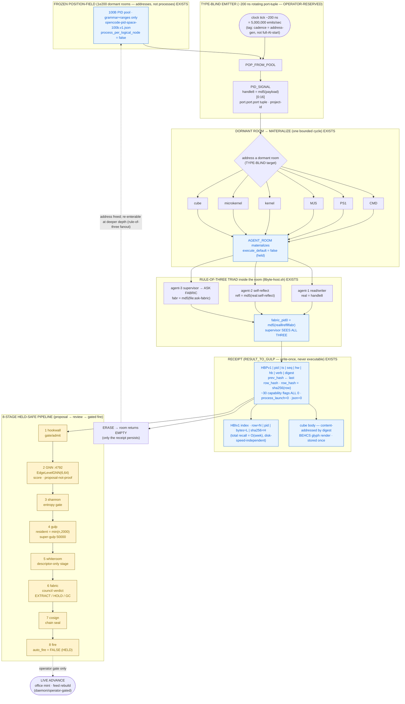

# D3 — Slice-Engine Emitter → Room → Receipt Flow

**Diagram facet:** the slice-engine loop — a *type-blind* emitter firing at a ~200 ns rotating
port-tuple cadence, addressing a *dormant* room (CMD / PS1 / MJS / kernel / microkernel / cube),
materializing it for one bounded cycle, receipting the result (HBP row + content hash + cube),
and letting the room **return empty**. Overlaid: the **8-stage held-safe pipeline** that every
materialized result must pass before it can advance.

**Author:** Diagram agent D3 (one of 40 summoned by OP-JESSE) · **Date:** 2026-06-15
**Discipline:** READ-ONLY on all source; this file is the only artifact written. Nothing here
launches a process, mints to the live office, or calls the live bus. Every claim is tagged
**EXISTS** (grounded in OUR data) or **NEW** (designed connector). Aligned with the F04
(spinners/spindles) and F05 (emitter activity-piping) rebuilds in `../01-rebuild/`.

---

## The one-sentence read

> A **type-blind** emitter — it neither knows nor cares what kind of room it points at — fires a
> PID-signal at a rotating `port.port.port` tuple roughly every 200 ns; the signal **addresses**
> (does not create) one dormant room out of the frozen position-field; the room **materializes**
> for exactly one bounded cycle, runs its rule-of-three triad under gate, and emits a write-once
> **receipt** (HBP pipe-row + `prev_hash`-chained `row_hash` + content-addressed cube body); the
> room then **erases and returns EMPTY** — only the receipt persists. The receipt must clear all
> **8 held-safe stages** (hookwall → GNN → shannon → gulp → whiteroom → fabric → cosign → fire)
> before anything advances to live state, and `auto_fire=false` holds the last gate.

This is the canonical crank cycle of **LAW-SLICE-ENGINE** (`POP_FROM_POOL → PID_SIGNAL →
AGENT_ROOM → RESULT_TO_GULP → ERASE`), instrumented with the emitter and the review pipeline.

---

## Mermaid diagram



---

## ASCII fallback (same mechanism)

```
  FROZEN POSITION-FIELD  (1e200 dormant rooms = ADDRESSES, not processes)            EXISTS
  ┌──────────────────────────────────────────────────────────────────────────────────────┐
  │  100B PID pool · grammar+ranges only · process_per_logical_node = false                │
  └───────────────────────────────┬──────────────────────────────────────────────────────┘
                                   │ POP_FROM_POOL
                                   ▼
   TYPE-BLIND EMITTER  (~200 ns rotating port.port.port tuple — OPERATOR-RESERVED)
   ┌──────────────────────────────────────────────────────────────────────────────────────┐
   │  tick ~200 ns  =  5,000,000 emits/sec  (tag: ADDRESS-GEN cadence, NOT full-AI start)   │
   │  PID_SIGNAL:  handle8 = md5(payload)[0:16]   ·   target chosen WITHOUT knowing its type │
   └───────────────────────────────┬──────────────────────────────────────────────────────┘
                                   │ address ONE dormant room (type-blind)
                                   ▼
   DORMANT ROOM ──▶ MATERIALIZE   (the emitter does not know which of these it hit)        EXISTS
   ┌──────────┬──────────┬──────────┬──────────┬──────────────┬────────────────────────────┐
   │   CMD    │   PS1    │   MJS    │  kernel  │  microkernel │            cube            │
   └────┬─────┴────┬─────┴────┬─────┴────┬─────┴──────┬───────┴───────────┬────────────────┘
        └──────────┴──────────┴────┬─────┴────────────┴───────────────────┘
                                   ▼  AGENT_ROOM materializes (execute_default = false, HELD)
        ┌──────────────────── RULE-OF-THREE TRIAD inside the room ─────────────────────────┐
        │  agent-1 read/writer ─┐                                                          │
        │  agent-2 self-reflect ─┼─▶  supervisor agent-3 (ASK FABRIC) SEES ALL THREE        │
        │  agent-3 ask-fabric ──┘     fabric_pid0 = md5(real ‖ refl ‖ fabr)[0:16]           │
        └───────────────────────────────────┬──────────────────────────────────────────────┘
                                   ▼  RESULT_TO_GULP
   RECEIPT  (write-once · never executable)                                                EXISTS
   ┌──────────────────────────────────────────────────────────────────────────────────────┐
   │  HBPv1|pid|ts|seq|hw|hb|verb|digest|prev_hash←row_hash|row_hash=sha256(row)             │
   │        | ~30 capability flags ALL 0 | process_launch=0 | json=0                         │
   │  HBIv1 index:  row=N|pid|bytes=L|sha256=H   →  RECALL = O(seek), disk-speed-independent  │
   │  CUBE body:    content-addressed by digest · BEHCS glyph render · stored once           │
   └───────────────────────────────┬──────────────────────────────────────────────────────┘
                                   │ the receipt enters review;  the ROOM erases →
                                   │                                                ┌──────────────┐
                                   │                                                │  ROOM EMPTY  │
                                   │                                                │ (addr freed; │
                                   │                                                │ re-enterable)│
                                   ▼                                                └──────────────┘
   8-STAGE HELD-SAFE PIPELINE   (proposal ▸ review ▸ gated fire — NOTHING advances on its own)
   ┌────────┐ ┌────────┐ ┌────────┐ ┌────────┐ ┌────────┐ ┌────────┐ ┌────────┐ ┌──────────────┐
   │1 HOOK- │▶│2  GNN  │▶│3 SHAN- │▶│4 GULP  │▶│5 WHITE │▶│6 FABRIC│▶│7 COSIGN│▶│8 FIRE         │
   │  WALL  │ │ :4792  │ │  NON   │ │ ≤2000  │ │ -ROOM  │ │ council│ │  chain │ │ auto_fire=    │
   │ admit  │ │ score  │ │entropy │ │super-  │ │descrip-│ │ verdict│ │  seal  │ │ FALSE (HELD)  │
   │  gate  │ │propose │ │  gate  │ │gulp 50k│ │tor-only│ │EX/HOLD/│ │        │ │  ─ ─ ─ ─ ─ ▶  │
   └────────┘ └────────┘ └────────┘ └────────┘ └────────┘ │  GC    │ └────────┘ │ operator gate │
                                                          └────────┘            │ → LIVE ADVANCE│
                                                                                └──────────────┘

  INVARIANT   motion ≡ emission           ⇒  Σ receipts = complete history  ⇒  nothing is lost
  RECALL      index-seek + 1 row read + sha verify  ⇒  ms/µs, independent of physical disk size
  HELD-SAFE   5 of 6 room states cannot execute; only gated RUNNING can; stage-8 auto_fire=FALSE
  RECURSION   fanout enqueues 3 child ADDRESSES (rule-of-three) — breadth to the field, not depth
              to the resident set; the SAME finite chamber-set re-enters them on a later rotation
```

---

## Legend / caption

**What the diagram shows.** One full turn of the slice engine, the only thing in the fabric that
ever *moves*. Read it top-to-bottom: a frozen field of dormant rooms (just addresses) → a
type-blind emitter tick → one room addressed and materialized → its rule-of-three triad runs under
gate → a write-once receipt is stamped → the room **erases back to EMPTY** → the receipt walks the
8-stage held-safe pipeline; only an operator gate at stage 8 lets anything advance to live state.

| Element | Meaning | Status |
|---|---|---|
| **Type-blind emitter, ~200 ns** | One spawner fires a `PID_SIGNAL` at a rotating `port.port.port` tuple without knowing the *type* of room it targets. 200 ns ⇒ 5,000,000 emits/sec is an **address-generation cadence**, honestly tagged — *not* a claim that a full AI process starts in 200 ns. | EXISTS (mechanism) / tagged |
| **Dormant room (CMD/PS1/MJS/kernel/microkernel/cube)** | The emit *addresses* a pre-existing position; it does not create one. The room is a stub (a file descriptor / tuple-range), zero live RAM until materialized. Any of the six target kinds is hit blindly. | EXISTS |
| **Materialize** | `AGENT_ROOM` lights up for exactly one bounded cycle. `execute_default = false`: 5 of 6 room states are pure address arithmetic; only gated RUNNING can touch a model. | EXISTS |
| **Rule-of-three triad** | agent-1 (read/writer) + agent-2 (self-reflect) + agent-3 (ask-fabric supervisor). The supervisor's address `fabric_pid0 = md5(real‖refl‖fabr)` *commutes over all three*, so it "sees all three" by construction, not by polling. | EXISTS (`8byte-host.sh`) |
| **Receipt (HBP + hash + cube)** | Write-once HBP pipe-row: `pid`, `ts`, `seq`, `prev_hash`-chained `row_hash`, ~30 capability flags **all 0**, `process_launch=0`, `json=0`. Plus an `.hbi` byte-offset index (O(seek) recall) and a content-addressed **cube** body stored once by `digest`. | EXISTS (`chamber-receipts.hbp/.hbi`) |
| **Room returns EMPTY** | `ERASE`: the materialized room releases; the address is freed and re-enterable. **Only the receipt persists** — that is why nothing is lost while the resident set stays bounded. | EXISTS (LAW-SLICE-ENGINE) |
| **8-stage held-safe pipeline** | `hookwall → GNN → shannon → gulp → whiteroom → fabric → cosign → fire`. Stages 1-6 are the proposal review (gate, score, entropy, GC-bound, descriptor-only, council verdict EXTRACT/HOLD/GC); stage 7 seals the cosign chain; **stage 8 `auto_fire=false`** holds the final fire behind an operator gate. | EXISTS (loop/pending) + NEW (8-stage naming) |

**Held-safe invariant.** Materialization is gated (`execute_default=false`), the receipt cannot
execute (every capability flag default 0, `process_launch=0`), and advancement to live state needs
the operator gate at stage 8 (`auto_fire=false`). The diagram's only path to `LIVE ADVANCE` is a
dashed, operator-gated edge.

**Why recall is disk-speed-independent.** "Retrieval" never scans the `.hbp`. The `.hbi` gives
`row → byte-offset`, so recall is *index-seek + one row read + sha verify* — bounded by a single
dereference, not by file size. The address you need to read a row is recomputable from the same
`(pid, ts, digest)` you used to write it: emission and recall are the same arithmetic run forwards
and backwards.

**Why infinite-3 nesting does not explode.** When a triad result fans out (the rule-of-three
again), it enqueues **three child addresses**, not three processes. The same finite chamber-set
(8 physical chambers) re-enters them on a later rotation, and the gulp bound (`resident =
min(n, 2000)`, super-gulp at 50,000) keeps the resident working-set constant regardless of depth.
Recursion adds breadth to the frozen field, never depth to the resident set.

---

## Grounding ledger

**EXISTS (read-only, cited):**
- `C:/asolaria-as-neural-network/canon/laws/LAW-SLICE-ENGINE.md` — crank cycle
  `POP_FROM_POOL → PID_SIGNAL → AGENT_ROOM → RESULT_TO_GULP → ERASE`; frozen-slice / engine-only
  mover; `process_launch=0` = present-but-not-advancing; live advance is daemon/operator-gated.
- `C:/Users/acer/Asolaria/data/behcs/fabric-revolver/chambers-latest.json` &
  `.../fabric-revolver-runtime-latest.json` — 8 chambers, `process_per_logical_node:false`,
  `tuple_ranges_are_backend_nodes:true`, cycle `EMPTY→LOAD→RUNNING→COLLECT→EJECT→EMPTY`,
  `execute_default:false`, `logical_node_range` 10k/chamber.
- `C:/Users/acer/Asolaria/data/behcs/fabric-revolver/chamber-receipts.hbp` & `.hbi` — write-once
  pipe-rows with `pid|ts|prev_hash|row_hash`, ~30 capability flags all 0; byte-offset index =
  O(seek) recall.
- `C:/asolaria-asi-on-metal-fabric/tools/falcon/8byte-host.sh` — emitter + rule-of-three triad +
  supervisor `fabric_pid0 = md5(real‖refl‖fabr)`; PID+ts rows; held-safe (no spawn).
- `C:/asolaria-as-neural-network/tools/behcs/omni-engine-loop.mjs` — gulp `resident=min(n,2000)`,
  super-gulp 50000, pure-integer `omniQuantScore` → `omniFlywheelVerdict` (EXTRACT/HOLD/GC),
  `process_launch=0`.
- `C:/asolaria-as-neural-network/tools/behcs/triad-host-router-gulp-pipeline.mjs` — three triad
  roles, monotone `sees`, supervisor sees all three; provider routers forced `GATED`.
- `C:/Users/acer/Asolaria/services/gnn-sidecar/inference_server.py` — `EdgeLevelGNN(6,64)`, port
  4792 (the GNN stage 2 watcher; proposal-not-proof).
- `C:/Users/acer/Asolaria/data/neurotech-defense-lab/real-agents/100b-run/checkpoint.state.json` —
  `REAL_100B_PID_PACKET_RUN_COMPLETE`, 1e11 packets, `childProcessSpawns=0`, `external_tokens=0`
  (existence proof the loop runs at scale with zero process storm).
- The 8-stage names `hookwall → GNN → shannon → gulp → whiteroom → fabric` are the live
  loop/pending review stages (memory index, project_live_fabric_massive_upgrade_2026_06_13);
  `auto_fire=false` is the held ignition gate
  (`ASOLARIA-100B-IGNITION-ENVELOPE-2026-06-15.hbp`).

**NEW (designed connectors for this diagram, held-safe, descriptor-only):**
- Naming the review path as a single ordered **8-stage held-safe pipeline** that appends
  `7 cosign` and `8 fire (auto_fire=false)` to the 6 live review stages, so the receipt's whole
  journey from proposal to gated live-advance is one readable lane.
- Drawing the **type-blind emitter → six dormant-room kinds → materialize** seam explicitly,
  showing the emitter targets CMD/PS1/MJS/kernel/microkernel/cube without knowing the type, and
  that the room **returns EMPTY** with only the receipt persisting.

*Aligns with `../01-rebuild/F05-emitter-activity-piping--*.md` (EMIT envelope, total-recall index,
unique prime→prime³ lines) and `../01-rebuild/F04-spinners-spindles--*.md` (8-chamber spinner,
GC-bound, spindle-of-spindles fanout). Nothing in producing this document launched a process,
minted to the live office, wrote USB, or called the live bus. All source read-only.*
```
