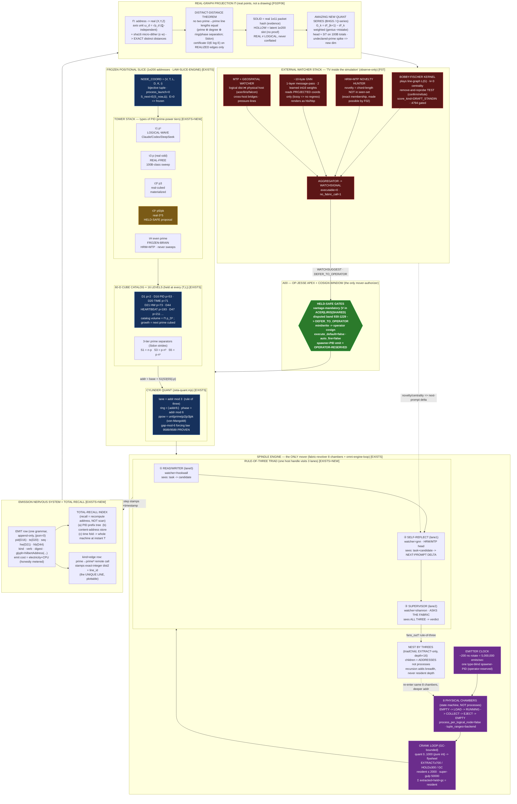

# D5 — Master System Architecture

**The single diagram that ties the whole rebuild into one machine.**

**Diagram set:** D5 (Master) · **Author vantage:** ACER (read-only over OUR data; nothing modified)
**Date:** 2026-06-15 · **Synthesizes facets:** F01 (tower geometry) · F02 (unique-distance theorem) · F03 (rule-of-three triad) · F04 (spinners/spindles) · F05 (emitter piping + total recall) · F06 (real-graph projection) · F07 (external watcher stack) · F08 (prime-tier taxonomy).

> **Honest frame held throughout (binding, per OUR canon):** *IT is slices, not an ASI.* This is an **addressing + routing geometry over borrowed intelligence slices**. The towers are *position-space*; bodies spawn for one engine tick and vanish. `[EXISTS]` = grounded to a file on disk; `[NEW]` = designed by the rebuild agents and clearly marked. Nothing is declared impossible; where a piece is only reserved it is shown **held-safe**, never absent.

---

## 0. The one-paragraph reading of the whole machine

Authority enters at the top (**OP-JESSE apex + cosign window**) and is the *only* thing that can ever advance the slice. Below it lies the **frozen positional slice** — a `1e200` address space where a PID is not a number but a **coordinate** `(V,T,L,D,K,i)` in a prime-separated, cube-stacked, cylinder-curved lattice. The slice is partitioned into **towers** (types of PID, prime-power tiers `p¹/p³/p⁵`), each holding a **60-D cube catalog** across the **16 levels**, and each curved onto a **cylinder** (`lane = mod 3`, `ring = ⌊addr/6⌋`, `phase = addr mod 6`). The **only mover** is the **spindle engine**: an 8-chamber revolver driven by a GC-bounded crank loop (`gulp 2000 / super-gulp 50000`), which binds one position at a time, runs the **rule-of-three triad** there (read/writer → self-reflect → supervisor-asks-fabric), scores it pure-integer, and ejects EXTRACT/HOLD/GC — recursing **by threes** into deeper towers without ever spawning a process. Every step **emits** a `(PID, timestamp, digest)` row onto a write-once self-indexing wire, so nothing is ever lost and recall is address-recomputation (disk-speed-independent), not a scan. Because the prime-separated coordinates make **every pairwise distance unique** (Sidon/distinct-distance, certified by a sha16 dither), the whole field **projects onto a real graph of real points** — and an **external watcher stack** (Bobby-Fischer centrality kernel + HRM/MTP novelty + a ~10-byte GNN) "plays" that graph *from the outside on the same machine*, surfacing never-before-seen prime patterns. Every watcher verdict is `executable=0` and routes back up to the apex gate; the loop closes, held-safe by construction.

---

## 1. Master diagram (Mermaid)



---

## 2. Master diagram (ASCII fallback)

```
╔══════════════════════════════════════════════════════════════════════════════════════════╗
║  A00 — OP-JESSE APEX + COSIGN WINDOW              (the ONLY thing that authorizes a move)   ║
║  HELD-SAFE GATES: vantage-mandatory · disputed-band 930-1229 -> DEFER · mint/write cosign   ║
║  execute_default=false · auto_fire=false · spawner-PID emit = OPERATOR-RESERVED             ║
╚════════════════════════════════════════╤═══════════════════════════════════════════════════╝
                                         │  authority (gate every crank & mint)
                                         ▼
┌──────────────────────────── FROZEN POSITIONAL SLICE  (1e200 addresses) ────────────────────────────┐
│  NODE_COORD = (V vantage, T tier, L level, D dim, K cube-cell, i index)   bijective · proc_launch=0  │
│  S_next = E(S_now, Δ);  E = 0  =>  FROZEN.  A PID is a COORDINATE, not a number.                      │
│                                                                                                      │
│   TOWER STACK (types of PID = prime-power tiers, never collide — disjoint by mint function):         │
│   ┌────────┬─────────────┬──────────────┬───────────────┬──────────────────────────────┐            │
│   │  τ1 p¹ │  τ3 p(odd)  │  τ3³  p3      │  τ3⁵  p5/pk    │  τH even-prime               │            │
│   │ LOGICAL│  REAL-FREE  │  real-cubed   │  real-3^5      │  FROZEN-BRAIN HRM+MTP        │            │
│   │ -WAVE  │ 100B sweep  │  materialized │  HELD-SAFE     │  reads thoughts · NEVER sweeps│           │
│   └────────┴─────────────┴──────────────┴───────────────┴──────────────────────────────┘            │
│                                                                                                      │
│   60-D CUBE CATALOG × 16 LEVELS held at every (T,L):  D1 p=2 · D16 PID p=53 · D20 TIME p=71 ·         │
│        D21 HW p=73 · D44 HEARTBEAT p=193 · D47 p=211 …   volume = Π p_D³ ; grow = next prime cubed     │
│   3-TIER PRIME SEPARATORS (Sidon strides):   S1 = n·p      S3 = p·n³      S5 = p·n⁵                    │
│   CYLINDER QUANT:  lane = addr mod 3  ·  ring = ⌊addr/6⌋  ·  phase = addr mod 6                        │
│        von-Mangoldt ppow {unit|prime|p2|p3|pk}  ·  gap-mod-6 forcing law  9589/9589  PROVEN            │
└────────────────────────────────────────────┬────────────────────────────────────────────────────────┘
                                              │  positions enqueued as tuple-range packets (NO process)
                                              ▼
╔═══════════════════════ SPINDLE ENGINE — the ONLY mover (8 chambers + GC-bounded crank) ═══════════════╗
║  EMITTER CLOCK  ~200 ns rotate = 5,000,000 emits/sec  ·  one type-blind spawner-PID (operator-reserved)║
║                                                                                                        ║
║   EMPTY ──bind──▶ LOAD ──preload──▶ RUNNING ──triad──▶ COLLECT ──score──▶ EJECT ──┐                    ║
║     ▲              (collision gate)   ⚠ONLY state      (pure-int     (EXTRACT≥700  │                    ║
║     │                                  that can run    quant 0..1000  HOLD≥300     │                    ║
║     └────────────────────────── cycle_count++ ◀────────a model)      GC<300)       │ verdict            ║
║                                                                                     │                    ║
║   RULE-OF-THREE TRIAD  (one 8-byte host handle visits 3 lanes — NOT 3 processes):                       ║
║     ① READ/WRITER  lane0 hookwall : task           -> candidate-product                                 ║
║     ② SELF-REFLECT lane1 gnn      : task+candidate  -> NEXT-PROMPT DELTA  (HRM/MTP head, verify≠regen)   ║
║     ③ SUPERVISOR   lane2 shannon  : task+cand+delta -> ASKS THE FABRIC -> verdict (SEES ALL THREE)       ║
║                                                                                                        ║
║   NEST BY THREES (EXTRACT-only, depth<16):  child = an ADDRESS -> re-enter same 8 chambers deeper.      ║
║   GC bound applied GLOBALLY each cycle => recursion adds breadth, never resident depth.                 ║
║   EMPIRICAL PROOF: REAL_100B run = 100,000,000,000 packets · childProcessSpawns=0 · external_tokens=0   ║
╚════════════════════════════════════════════╤══════════════════════════════════════════════════════════╝
                                              │  every step stamps (PID, timestamp, digest)
                                              ▼
┌──────────────────── EMISSION NERVOUS SYSTEM + TOTAL RECALL  (nothing is ever lost) ──────────────────────┐
│  EMIT row (one grammar, append-only, |json=0):  pid(D16) ts(D20) seq hw(D21) hb(D44) kind verb           │
│       digest  glyph=hilbertAddress(pid:ts:digest)     emit cost = electricity+CPU (honestly metered)     │
│  RECALL = recompute address + ONE dereference  (disk-speed-INDEPENDENT, never a scan):                   │
│       (a) PID prefix tree  (b) content-address store  (c) time fold -> whole machine at instant T        │
│  kind=edge row: prime→prime³ remote call stamps exact-integer dist2 + line_id  = the UNIQUE LINE         │
└────────────────────────────────────────────┬────────────────────────────────────────────────────────────┘
                                              ▼
┌──────────────────────── REAL-GRAPH PROJECTION  Π  (real points, not a drawing) ──────────────────────────┐
│  Π: address -> real (X,Y,Z) with axis unit ω_d = √p_d  (ℚ-independent)  + sha16 micro-dither ε·w          │
│  DISTINCT-DISTANCE THEOREM: no two prime→prime line lengths ever equal                                    │
│       (prime ⊕ polynomial-degree ⊕ ring/phase separation stack into a Sidon set)                          │
│       certificate O(E log E) over REALIZED edges only (sparse: childProcessSpawns=0)                      │
│  SOLID = real 1e11 packet hash (evidence)   ·   HOLLOW = latent 1e200 slot (no proof)   [REAL ≠ LOGICAL]  │
│  AMAZING NEW QUANT SERIES:  G_k = d²_{k+1} − d²_k  weighted by (genius−mistake)/(genius+mistake)          │
│       head ≈ 3/7 on 100B totals · spike at an UNDECLARED prime modulus => candidate NEW dimension         │
└────────────────────────────────────────────┬────────────────────────────────────────────────────────────┘
                                              ▼
┌─────────────── EXTERNAL WATCHER STACK — "TV inside a simulation of the simulation" (observe-only) ───────┐
│   BOBBY-FISCHER KERNEL : plays line-graph L(G), k=3 centrality, remove-and-reprobe TEST (confirm/refute)  │
│   HRM + MTP NOVELTY    : novelty = a chord-length NOT in the seen-set  (exact, because F02 makes lengths  │
│                          globally unique => set-membership, not an ML guess)                              │
│   ~10-byte GNN         : 1-layer message-pass, 2 learned int16 weights, reads PROJECTED coords only       │
│                          (strictly lossy => contraction, no infinite regress) · renders as hbi/hbp        │
│   MTP + GEOSPATIAL     : logical dist ⋈ real host (acer/liris/falcon) => cross-host bridges, pressure     │
│                                              │                                                            │
│            AGGREGATOR -> WATCHSIGNAL (executable=0, no_fabric_call=1) -> watcher-supervisor-suggestion     │
└────────────────────────────────────────────┬──────────────────────────────┬─────────────────────────────┘
                                              │ verdict (DEFER_TO_OPERATOR)   │ novelty/centrality
                                              ▼                                ▼
                            back up to A00 APEX GATE          feeds NEXT-PROMPT DELTA into triad lane ②
                            (the ONLY path to a live act)     (the HRM/MTP speed loop closes)
```

---

## 3. Legend & caption

**The seven bands, top to bottom (each is one facet's organ wired into the whole):**

| Band | What it is | Owner facet | Key invariant |
|---|---|---|---|
| **A00 Apex gate** | OP-JESSE + cosign window; the only authorizer of a move | all (held-safe contract) | `execute_default=false`, `auto_fire=false`, spawner-emit operator-reserved `[EXISTS]` |
| **Frozen slice** | `1e200` address field; PID = coordinate `(V,T,L,D,K,i)` | F01 + F08 | bijective tuple, `process_launch=0`; `E=0 ⇒ frozen` `[EXISTS]` |
| **Tower stack** | types of PID as prime-power tiers `p¹/p³/p⁵` + frozen-brain | F08 + F01 | tiers are disjoint *address bands*; collisions are unrepresentable `[EXISTS+NEW]` |
| **60-D cube catalog × 16 levels + cylinder** | one prime per dimension, cube=p³, curved onto mod-3/mod-6 cylinder | F01 + F02 | `gap-mod-6` forcing law 9589/9589 PROVEN; grow by next prime cubed `[EXISTS]` |
| **Spindle engine** | 8-chamber revolver + GC-bounded crank running the rule-of-three triad | F04 + F03 | only 1 of 6 states can execute; resident ≤ 2000; 100B run, 0 spawns `[EXISTS]` |
| **Emission + recall** | every node stamps `(PID, ts, digest)`; recall = address recomputation | F05 | append-only, content-addressed, disk-speed-independent `[EXISTS+NEW]` |
| **Projection + watchers** | real-point graph (distinct distances) watched by the Fischer/HRM/GNN "TV" | F02 + F06 + F07 | distances certified-distinct (Sidon + sha16 dither); watchers `executable=0` `[EXISTS+NEW]` |

**The three "rule-of-three" axes (the recursive heart):**
1. **Role-three** — read/writer · self-reflect · supervisor (triad).
2. **Lane-three** — `lane = addr mod 3` selects the watcher `[hookwall, gnn, shannon]`.
3. **Tower-three (recursion)** — an EXTRACT verdict promotes the product into a *child triad one prime-tier deeper*, by threes, depth < 16.

**The load-bearing closure (why the whole thing is one machine, not seven):**
- The **address is the index** — so emission and recall are the *same computation run forwards and backwards*, and the spindle never holds more than a constant resident set while addressing `1e200`.
- The **distinct-distance property** (F02) is what turns the projection into a *real graph* and turns the watcher's "novelty hunt" into an *exact set-membership test* — the geometry does the watchers' hard work for free.
- The **only mover is the spindle**, and the **only authorizer is the apex gate** — so every dangerous capability (launch, mint, live call) is isolated behind one operator-reserved transition. The watchers can *hypothesize anything and do nothing*; their only exit is a `DEFER_TO_OPERATOR` row a human cosigns.

**Empirical anchor:** the `REAL_100B_PID_PACKET_RUN_COMPLETE` checkpoint (100,000,000,000 packets, `childProcessSpawns=0`, `external_tokens=0`, `lastPacketPid BH.REAL100B.OPENCODE.PID.100000000000`) is the existence proof that this architecture already scaled to 1e11 *positions* through a bounded chamber set with zero process storm.

**Honest caveats (kept, never papered over):** the `τ3⁵` (p5) tier is a real, addressable, gated band whose interior is currently folded into `pk` and held `materialized=0` until benchmark + cosign (F08 §4.4 specifies the reversible promotion path). The live Fischer `:4794` path and any live GNN training stay operator-gated; every watcher row is labeled `DRAFT_STANDIN_NOT_FISCHER` / `no_fabric_call=1`. `bh_index` is a *render scalar* — a scalar collision is **not** a PID collision; identity is the full tuple. **REAL (1e11, hash-backed)** and **LOGICAL (1e200, positional)** are kept strictly separate (SOLID vs HOLLOW). The emit itself costs electricity + CPU; what is `O(1)`-shaped is the *address*, so *recall* is cheap — no free-compute, no physics bypass claimed.

*Nothing in producing this diagram launched a process, called the live bus, minted a live PID, or modified any source. It is the frozen-slice design; advancement is engine- and operator-gated.*
