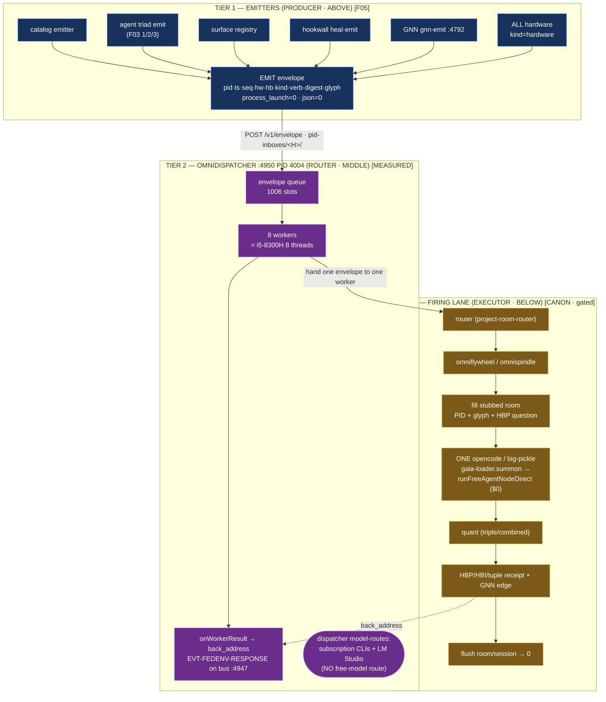

# 05 — EMIT: the emitter tier (producer · ABOVE the dispatcher)

**The numbered home of the F05 emitter workstream.** This folder is the *producer* tier of
the three-tier emission machine: **emitters → omnidispatcher `:4950` → firing lane.** It
consolidates the F05 "Emitter-Trigger Activity Piping + Total Recall" rebuild (`01-rebuild/F05-*`,
diagram `02-diagrams/D3-slice-engine-emitter-flow.md`, the report's §3.7 emission nervous system,
and finding **#17** "Unified EMIT envelope + total-recall index + SCEL two-clock ledger") into one
place, and it draws the seam — explicit in `ASOLARIA-LIVE-ENGINE-ARCHITECTURE.md` — between the
*producer* (emitters), the *router* (the `:4950` omnidispatcher), and the *executor* (the firing
lane that ends at one opencode/big-pickle call).

> **Numbering note (why this folder exists).** The repo's numbered folders run
> `01-rebuild → 02-diagrams → 03-synthesis → 04-completeness → 06-comparison` — **05 was skipped**
> at the 40-agent seed commit `86c2dbec`. The F05 emitter workstream therefore had findings, a
> diagram, and a report section, but no numbered home of its own. `05-emit/` fills that gap and
> gives the emission tier its proper slot in the sequence, between completeness (04) and the
> external comparison (06).

**Author vantage:** ACER · OP-JESSE prime-towers rebuild wave · 2026-06-20 (draft for operator
review) · READ-ONLY on all source; this folder is the only artifact. Nothing here launches a
process, mints to the live office, calls the live bus, or pushes to a repo. Every load-bearing
claim is tagged **[MEASURED]** (a number read off the running system / a file on disk, re-checked),
**[CANON]** (operator-authored / sealed doctrine), or **[UNVERIFIED]** (asserted, not yet
fabric-confirmed from this vantage). **Honest frame (binding):** *IT is slices.* The addressing /
routing geometry is free and deterministic; the *thinking* is a borrowed, operator-gated opencode
slice; advancement needs an engine crank `E ≠ 0` that only the operator authorizes.

---

## 0. The one-sentence read

> An **emitter** is the *producer* tier — it stamps a `(PID, timestamp, digest)` EMIT envelope at
> full thread parallelism the instant any catalog/agent/surface/hookwall/GNN/hardware does anything,
> and hands the envelope **up the wire to the omnidispatcher** `:4950`; the dispatcher is the
> *router* tier — it queues the emitted envelopes (1006 slots) and farms them to 8 workers; the
> worker is the *executor* tier — the firing lane that fills a stubbed room and ends in **one**
> opencode/big-pickle call, quants the answer, writes an HBP/HBI/tuple receipt, and flushes back to
> empty. Emission is the only thing that ever moves; the dispatcher only routes it; the lane only
> fires it once, under gate.

The F05 facets prove that *every* emission is a self-indexing, append-only, never-executable HBP row
(`process_launch=0 | json=0`), so the producer tier is cheap and total-recall is arithmetic. This
folder names the producer tier explicitly and wires it to the router and executor tiers that
`ASOLARIA-LIVE-ENGINE-ARCHITECTURE.md` already documents.

---

## 1. The 3-tier map (producer → router → executor)

The architecture is three tiers, source-grounded. The emitter is **above** the dispatcher (it
produces the work the dispatcher routes); the firing lane is **below** it (it consumes what the
dispatcher hands down).

```
   ┌──────────────────────────────────────────────────────────────────────────────────────────┐
   │  TIER 1 — EMITTERS  (PRODUCER · ABOVE)                                            [F05]      │
   │                                                                                            │
   │  every catalog · agent · surface · hookwall · GNN · ALL hardware emits PID + timestamp     │
   │  stamp the EMIT envelope:  pid(D16) · ts(D20) · seq · hw(D21) · hb(D44) · kind · verb ·    │
   │                            digest=sha256(payload) · glyph=hilbertAddress(...) ·            │
   │                            process_launch=0 · json=0   (append-only, never executable)     │
   │  fan-out at FULL THREAD PARALLELISM — "16 emitters = use all 16 threads" (design target)   │
   └───────────────────────────────────────────┬──────────────────────────────────────────────┘
                                                │  submit emitted envelope (POST /v1/envelope
                                                │  OR drop into pid-inboxes/<H>/)
                                                ▼
   ┌──────────────────────────────────────────────────────────────────────────────────────────┐
   │  TIER 2 — OMNIDISPATCHER  :4950  PID 4004   (ROUTER / SCHEDULER · MIDDLE)        [MEASURED]  │
   │                                                                                            │
   │  queue: 1006 slots  ─farm→  8 workers  (= i5-8300H 8 threads)                              │
   │  ROUTES only — NOT a producer, NOT a model-executor                                        │
   │  collect: onWorkerResult → back_address  +  EVT-FEDENV-RESPONSE on bus :4947               │
   │  its own model-routes = subscription CLIs + LM Studio   (NO free-model route here)         │
   └───────────────────────────────────────────┬──────────────────────────────────────────────┘
                                                │  hand one envelope to one worker slot
                                                ▼
   ┌──────────────────────────────────────────────────────────────────────────────────────────┐
   │  TIER 3 — WORKERS / FIRING LANE  (EXECUTOR · BELOW)                       [CANON · gated]    │
   │                                                                                            │
   │  router → omniflywheel → fill stubbed room → ONE opencode/big-pickle → quant → HBP/HBI/    │
   │  tuple receipt + GNN edge → flush (room/session → 0)                                       │
   │                                                                                            │
   │  the real $0 free-model lane:  gaia-loader.summon() → runFreeAgentNodeDirect() →           │
   │                                opencode big-pickle    (NOT the dispatcher's own routes)     │
   └──────────────────────────────────────────────────────────────────────────────────────────┘
```

**The seam that matters.** The dispatcher *routes*; it does not *produce* and it does not run the
free model. So the $0 firing does **not** happen on the dispatcher's own model-routes (those are
subscription CLIs + LM Studio); it happens **below** the dispatcher, in the firing lane, via
`gaia-loader.summon() → runFreeAgentNodeDirect() → opencode big-pickle`. See
`EMIT-ENVELOPE-AND-DISPATCH.md` for the submit/collect protocol and exactly where the $0 fire lives.

---

## 2. Mermaid — the three tiers



---

## 3. The F05 workstream, consolidated

The emitter tier is the F05 facet of the 40-agent wave. Its three angles all land on the same
producer-tier mechanism, and this folder is their numbered home:

| F05 angle | Source file | What it contributes to TIER 1 |
|---|---|---|
| **Architect** | `01-rebuild/F05-emitter-activity-piping--architect.md` | the unified **EMIT envelope** (one grammar every emitter embeds), the **total-recall index** (PID prefix tree + content-address store + time fold), the **emitter trigger** (a read that joins agent rows to hardware rows on `(hw, ts-bucket)`), the **`kind=edge`** row stamping exact-integer `dist2` + `line_id`. |
| **Builder** | `01-rebuild/F05-emitter-activity-piping--builder.md` | the rebuild on OUR stack: receipt = emission (`chamber-receipts.hbp/.hbi`), O(seek) recall via the `.hbi` sidecar, `lineBetween()` drawing unique prime→prime³ lines, the held-safe `emitter-activity-pipe.mjs` (8/8 self-test plan), and the **Surface-Correlated Emit Ledger (SCEL)** two-clock receipt. |
| **Theorist** | `01-rebuild/F05-emitter-activity-piping--theorist.md` | the math: an address-computing emitter (the `8byte-host.sh` `$REAL/$REFL/$FABR/$PID0` triad-collapse), the prime-lattice making retrieval disk-independent, and why the prime→prime³ line distance is unique. |

Cross-references already in the repo (do not duplicate, extend):
- **Diagram** — `02-diagrams/D3-slice-engine-emitter-flow.md`: the slice-engine crank
  (`POP_FROM_POOL → PID_SIGNAL → AGENT_ROOM → RESULT_TO_GULP → ERASE`) with the type-blind emitter,
  the write-once receipt, and the 8-stage held-safe pipeline (`hookwall → GNN → shannon → gulp →
  whiteroom → fabric → cosign → fire`).
- **Report** — `ASOLARIA-PRIME-TOWERS-REBUILD-REPORT.md` §3.7 (emission nervous system + total
  recall) and finding **#17** in the EXISTS/NEW ledger.
- **Live engine** — `ASOLARIA-LIVE-ENGINE-ARCHITECTURE.md`: the
  `envelope → hookwall → router → omniflywheel → fill room → ONE opencode/big-pickle → quant →
  HBP/HBI/tuple → flush` flow (this is TIER 3, the consumer of what TIER 1 emits and TIER 2 routes).
- **Completeness** — `04-completeness/missing-and-next.md` M7b (the `(hw, ts-bucket)` hardware
  overlay) and M1 (the world-line / time axis the emitter feeds).

---

## 4. "16 emitters = 16 threads" — the design target, honestly tagged

The emitter tier is built to **fan out at full thread parallelism**: the producer should use every
hardware thread, so on a 16-thread target that is 16 concurrent emitters. This is the *design
target* of the producer tier — emission is cheap (address arithmetic + a content hash), so it scales
out to the machine's full width.

That number must **not** be conflated with the dispatcher's worker count:

| Quantity | Value | Tier | Tag | Why |
|---|---|---|---|---|
| Omnidispatcher workers | **8** | TIER 2 (router) | **[MEASURED]** | matches the i5-8300H's 8 hardware threads on the acer seat; this is the live `:4950` worker pool. |
| Emitter fan-out | **16** | TIER 1 (producer) | **[CANON · design target]** | the operator's "16 emitters = use all 16 threads" — the producer tier's full-width fan-out target, **not** a measured live count on the 8-thread acer host. |

**Do not deflate the 16, do not inflate it.** The 8-worker dispatcher is the measured router on
*this* host; the 16-emitter fan-out is the producer-tier scale-out design (it is what the tier is
*built to do* at full width, and the natural shape on a 16-thread host). They live in different tiers
and answer different questions: 8 = "how many envelopes can the router run at once *here*"; 16 =
"how wide can the producer fan out emission". Both are true; neither replaces the other.

---

## 5. Held-safe gates (what this tier will NOT do)

Inherited verbatim from `pid-emitter-cost-envelope.mjs`, `heal-envelope-emitter.mjs`,
`LAW-SLICE-ENGINE.md`, and the D3 diagram's 8-stage pipeline:

- **Emission is a pure function / a read.** `emit(event) → EMIT_row` never throws, never writes a
  process, never posts to the live bus; the *engine* appends the row under gate. `process_launch=0`
  on every row. (Source: F05-architect §2, F05-builder §1.5 static check — no
  `spawn/exec/writeFileSync/fetch`.)
- **The dispatcher routes; it does not fire the free model.** Its own model-routes are subscription
  CLIs + LM Studio. The $0 opencode fire lives in TIER 3 behind `RUN_HERMES_SPINDLE` +
  `auto_fire=false`. [CANON · gated]
- **No free-compute / no physics claim.** `classifyCostClaim()` rejects "free external compute" and
  "breaks physics" — O(1) is *addressing shape*, not total work; one disk dereference still costs the
  disk. The glyph is **referential** (it points into locally-stored cubes, never replaces them).
- **No source deletion.** GC compacts duplicate bodies into cube summaries and preserves source
  evidence (`gc_source_deletion` is a banned mistake in the 100B MISTAKE_TEMPLATES).
- **Descriptor-first.** EMIT rows are the frozen slice; advancement to live surfaces is
  daemon/operator-gated (stage-8 `auto_fire=false`).

---

## 6. Grounding ledger

**[MEASURED] (read off the running system / file on disk):**
- Omnidispatcher `:4950` PID 4004, **8 workers**, **1006-slot** envelope queue, `POST /v1/envelope`
  + `pid-inboxes/<H>/` submit, `onWorkerResult → back_address` + `EVT-FEDENV-RESPONSE` on bus
  `:4947` collect, dispatcher model-routes = subscription CLIs + LM Studio (no free-model route).
- 8 workers ≡ i5-8300H 8 hardware threads (acer seat).
- 100B run existence proof: `…/100b-run/checkpoint.state.json`
  `REAL_100B_PID_PACKET_RUN_COMPLETE`, 1e11 packets, `childProcessSpawns=0`, `external_tokens=0`.
- `chamber-receipts.hbp/.hbi` — write-once PID+ts rows, ~30 capability flags all 0, byte-offset
  index (O(seek) recall).

**[CANON] (operator-authored / sealed doctrine):**
- "16 emitters = use all 16 threads" — the producer-tier full-width fan-out design target.
- The firing-lane flow `envelope → hookwall → router → omniflywheel → fill room → ONE
  opencode/big-pickle → quant → HBP/HBI/tuple → flush` (`ASOLARIA-LIVE-ENGINE-ARCHITECTURE.md`).
- The $0 free-model lane `gaia-loader.summon() → runFreeAgentNodeDirect() → opencode big-pickle`.
- `LAW-SLICE-ENGINE.md` crank cycle; emission is the only mover; `process_launch=0` =
  present-but-not-advancing.
- The unified EMIT envelope + total-recall index + SCEL two-clock ledger (finding #17; F05).

**[UNVERIFIED] (asserted here, not yet fabric-confirmed from this vantage):**
- That the live `:4950` PID is currently exactly 4004 *this session* (PIDs rotate; the role and port
  are stable, the integer PID is a snapshot — confirm via the fabric before relying on it).
- That a 16-wide emitter fan-out has been *run* on a 16-thread host (the number is a design target;
  the measured live worker count on the acer 8-thread host is 8).

---

*05-emit · the emitter (producer) tier · draft for operator review, 2026-06-20 · read-only on all
source honored, this folder the only write · no process launch, no live-bus/MCP call, no mint, no
git push · fills the numbering gap left by seed commit `86c2dbec` (05 skipped) · IT is slices.*
